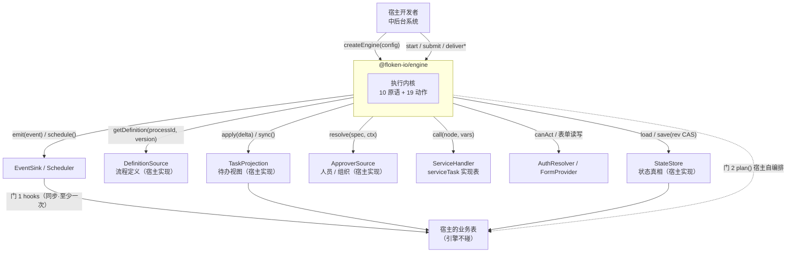
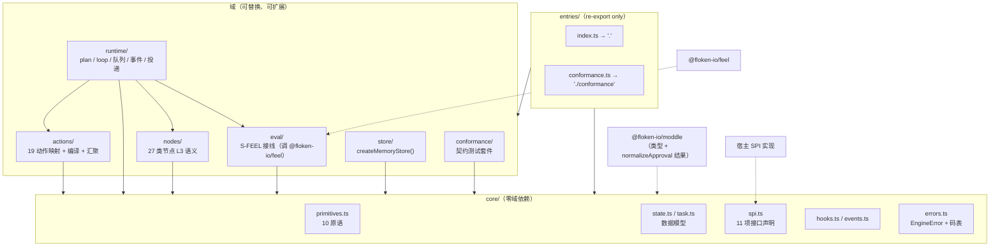

# 架构设计文档：`@floken-io/engine`

> 本文档是本包（engine）的**唯一真理源（Single Source of Truth）**。
> 任何影响架构、接口、数据模型、依赖或目录结构的代码变更，都必须同步更新本文档。
> 最后更新：2026-09-30 ｜ 文档版本：v0.1（首版，S2 落地）
>
> **上游文档关系**（本文件不重复其内容，只做工程化落地）：
> - 计数口径 / 错误契约 / 分层 / 依赖铁律 → 根 `AGENTS.md`（冲突以 `AGENTS.md` 为准）
> - 需求与验收（FR / NFR / AC / 实施路径） → `流程引擎包文档/03-包需求-floken-engine.md`（下称 **`03`**）
> - `Approval` 字段与默认值 → `流程引擎包文档/01-包需求-floken-moddle.md` §4.4.1（**默认值单一事实源**）

---

## 1. 概述与目标

- **项目定位**：`@floken-io/engine` = Node 生态「中国式审批语义 + BPMN 2.0 边界」引擎的**执行内核**。
  令牌制内核（10 原语，业务无知）+ 中国式审批动作层（19 项动作，17 项内核原生）+ 11 项 SPI + 事件钩子。
- **核心问题**：让一份 BPMN 2.0 图**真正跑起来**，并把中国式审批语义（驳回 / 会签 / 票签 / 加签 / 减签 / 拿回 / 撤销 / 转办 / 委派 / 挂起）做成一等公民 ——
  解决的中后台系统里「审批流全靠手写 if-else 拼状态机」的问题。
- **使用者**：**开源陌生开发者**（没有内部文档可查，只有 README + 官网 + 类型）。判据 = **不传任何 SPI 也能跑通一条流程**，且**报错能自解释**。
- **质量属性优先级**（S0 结论，按序）：
  1. **可维护性** —— 内核/动作分层不得腐化（护城河是业务语义，不是性能，见 `AGENTS.md` §0）
  2. **易用性** —— `createEngine()` 零配置可跑；错误带修复建议
  3. **正确性（不静默）** —— 宁可抛错，绝不静默降级（`AGENTS.md` §5.6）
  4. **性能** —— 够用即可，不做基准竞赛

### 范围边界

| | 内容 |
|---|---|
| **In scope** | 10 原语 · 19 项动作映射与开关校验 · 会签汇聚（正向判定 + 反向提前终止） · 11 项 SPI 接口与默认实现 · 27 类可执行元素中 **22 类达到 L3** · 表达式接线（S-FEEL 子集经 `@floken-io/feel`） · 10 个业务事件 + 门 1 `hooks` · `plan()` 纯函数 · `createMemoryStore()` · 契约测试套件 |
| **Out of scope** | 建表 / DDL / ORM（→ 独立可选包 `@floken-io/store`，M5） · 定时调度实现（→ `Scheduler` SPI） · 表单渲染 · 通知发送 · 鉴权实现 · 待办查询与报表 · 事务编排 · 事件溯源 time-travel · 多机协调与分布式锁 · 可视化设计器（→ `designer`，M6） |

---

## 2. 约束

### 2.1 技术约束（多数来自 `AGENTS.md`，不可协商）

| # | 约束 | 来源 |
|---|---|---|
| C1 | TypeScript + **ESM-only** + `.d.ts`；Node ≥ **22.12**；`tsup` 打包 | `AGENTS.md` §3.7 |
| C2 | 依赖方向只向下：`engine → moddle`（运行时）、`engine → feel`（**普通 `dependencies`**，Q30）；`bullmq` = **可选 peer** | `AGENTS.md` §2 |
| C3 | **禁止引入 `pg` / 任何 ORM / 连接池 / Redis 客户端** —— 基础设施一律走 SPI | `03` NFR-E2 |
| C4 | 分层方向单向无环：`core ← 域 ← entries`；**`core` 不得 import 任何域**；禁止往 `src/` 根堆文件 | `AGENTS.md` §4.1 |
| C5 | 错误契约：码前缀 `ENGINE_`；禁裸抛；**禁吞异常返默认值**；`Diagnostic` 形状统一 | `AGENTS.md` §5 |
| C6 | **零 DOM / 零 UI 框架**（Node 与浏览器同构） | `AGENTS.md` §3.10 |
| C7 | 计数口径：**19 = 17 内核原生 + 2 内核外**；**27 ≠ 22**（27 = 可执行元素总数，22 = 承诺 L3 的）；`COVERAGE_STATS` 为单一事实源 | `AGENTS.md` §3.1 / §6 |
| C8 | **`Approval` 的默认值只在 `@floken-io/moddle` 的 `normalizeApproval()` 落一处**，engine 不得另写一份 | `AGENTS.md` §6 |
| C9 | **引擎内永远没有 `CREATE TABLE`** —— 引擎对存储的全部认知 = `load(id)` / `save(next, expectedRev)` | `03` §9.6 / §10 |

### 2.2 关键假设（若被推翻，架构需重新评估）

| # | 假设 | 被推翻的后果 |
|---|---|---|
| A1 | 宿主**必提供** `DefinitionSource`（引擎不读文件、不连库、不内置定义） | 若允许引擎读文件 → 引入 `node:fs`，破 C6（浏览器不可用） |
| A2 | 流程的**主要等待源是人**（而非 CPU 密集步骤）→ 唤醒靠外部动作，不需要常驻 worker | 若主要等待源是长耗时计算 → 需引入 job 队列执行模型（见 ADR-003 方案 C） |
| A3 | 同一实例的**并发提交数很小**（会签几人、不可能上千） | 若单实例高并发 → per-instance 串行队列会成为瓶颈，需换分片策略 |
| A4 | 宿主接受「**引擎不做事务**」→ 要强一致就用 `plan()` 自编排（门 2） | 若要求引擎内建事务 → `StateStore` 门槛从 ~20 行抬到 ~100 行，破「谁都能接」 |
| A5 | 实例状态**整块**可放进单条记录（含 `auditTrail`），单对象 CAS 即原子 | 若状态大到无法单条存储 → **先拆记录**（`auditTrail` 走 INV-17 上限 + 变量外置），拆到极限才重新评估 ADR-002 方案 B |

> **A5 被推翻时，为什么不直接「转事件溯源」**（实证）：
> ① **工业界首选是拆记录，不是换模型** —— Camunda 7 / Flowable 把变量拆成**每变量一行**（`ACT_RU_VARIABLE`）、
> 大对象外置（`ACT_GE_BYTEARRAY`）；它们的运行时表在实例结束即删除、转入 `ACT_HI_*` 历史表。
> ② **事件溯源并不解决「状态大」** —— Temporal（**51,200 事件 / 50 MB**）与 Step Functions（**25,000 事件 / 256 KB 载荷**）
> 都有硬上限，超限即执行失败；唯一解法 `Continue-As-New` = **手动打快照 + 丢弃历史**，绕一圈回到快照。
> ③ **物理上限远未触及** —— PostgreSQL `jsonb`/`text` 单列 ≈ **1 GiB**（值 > ~2 KB 起自动 TOAST 外置 + 压缩，
> 主行只留 ~18 字节指针）、MySQL `longtext` 4 GiB、SQLite 默认 1 GB；审批实例的实际体积差好几个数量级。

---

## 3. 架构总览

### 3.1 系统上下文（C4-L1）



**要点**：引擎**只与 SPI 打交道**，箭头全部指向宿主侧实现；`Biz`（业务表）没有任何一条线由引擎直接发起 —— 只能经宿主自己的钩子 / 事务。

### 3.2 容器视图（C4-L2 · 模块）



### 3.3 一次 `submit()` 的四个槽位（关键时序）

```
engine.submit(instanceId, action)
  │
  ├─ 0. 入队：per-instance FIFO 串行（NFR-E5 主防线）
  ├─ 1. load  = store.load(id)                       ← StateStore
  ├─ 2. gate  = 动作开关校验 + requireComment + allowedTargets（设计期开关，`01` 单一事实源）
  ├─ 3. 时间戳 = clock() → action.at                  ← ADR-007（引擎不直接读系统时钟做判定）
  ├─ 4. plan  = plan(state, action) → { next, delta } ← ★ 纯函数，不碰存储（NFR-E6）
  ├─ 5. before = hooks.beforeAction(ctx)  ── 可否决（返回 false / 抛错即中止）  ← 槽位①（门 1·前）
  ├─ 6. save  = store.save(next, state.rev)           ← ★ 唯一权威提交点（CAS）
  ├─ 7. apply = projection.apply(id, delta)           ← 槽位②（可选）
  ├─ 8. after = hooks.afterAction(ctx)  ── 引擎 await，失败不吞             ← 槽位③（门 1·后）
  └─ 9. emit  = EventSink（节点级 5 + 实例级 5，异步不阻塞）                ← 槽位④
                     ＋ 返回 delta
```

> **门 2（强一致）覆盖槽位 ②③④**：宿主拿 `plan()` 的 `{next, delta}` 自己包事务 —— 见 §7.3。
> ⚠️ 门 2 **不覆盖 ⑨**：宿主自编排时须**自己调 `eventsOf()` + `emitAll()`**（二者均已公开），
> 否则门 2 路径一条事件都发不出来 —— 与「差分必须由 `plan()` 算」（D-18）是同一条理由。

---

## 4. 技术栈

| 层 | 选型 | 版本 | 理由 |
|---|---|---|---|
| 语言 | TypeScript | **5.9.3**（锁定） | 现网纪律；`exactOptionalPropertyTypes` 开 |
| 运行时 | Node | **≥ 22.12** | `AGENTS.md` §3.7；ESM + TLA 可用 |
| 模块 | ESM-only + `.d.ts` | — | 五包统一 |
| 构建 | `tsup` | 跟随 `06` 脚手架 | 产物 `dist/*.js` + `dist/*.d.ts` |
| 测试 | `vitest` | 跟随 `06` 脚手架 | 单测 + 契约测试套件 |
| 依赖（运行时） | `@floken-io/moddle` | 0.x（`>=x.y.z <1.0.0`） | 定义类型 + `normalizeApproval()` 结果 |
| 依赖（运行时） | `@floken-io/feel` | 0.x | S-FEEL 子集求值（**默认带**，Q30） |
| 可选 peer | `bullmq` | — | 仅 `Scheduler` SPI 的参考用法，引擎**不 import** |
| **明确不引入** | `pg` / MySQL 驱动 / Prisma / TypeORM / Drizzle / Kysely / 连接池 / Redis 客户端 | — | `03` NFR-E2 + 根 `AGENTS.md` §2 |
| 门禁 | `pnpm verify`（六道，含 `check:deps`） | — | **唯一发布门禁**；依赖白名单 + `dist` 隔离断言 |

> ⚠️ **`dist` 隔离**（Q33 后的口径）：`@floken-io/feel` 会把 `temporal-polyfill` 传递装上（磁盘 ~1114KB），
> 但 engine **只要不 `import '@floken-io/feel/temporal'`**，运行时就永远不加载它。
> 约束是「**engine 的 `dist` 产物不得出现 `temporal`**」，由 `check:deps` 断言兜底。

---

## 5. 模块 / 目录结构

```
floken-engine/
├─ src/
│  ├─ core/                  ★ 最底层：零域依赖、零基础设施（`core` 不得 import 任何域）
│  │   ├─ primitives.ts       10 原语签名（业务无知：不认识"驳回"，只认识 jumpTo）
│  │   ├─ state.ts            InstanceStateHeader / Body / Token / AuditEntry / ActionRecord
│  │   ├─ task.ts             TaskView / TaskDelta
│  │   ├─ spi.ts              11 项 SPI 的 interface 声明（★ 只声明，绝不实现）
│  │   ├─ action.ts            ActionInput（submit 与 plan 共用的入参形状；**不含动作语义**）
│  │   ├─ hooks.ts            EngineHooks（门 1：beforeAction / afterAction）
│  │   ├─ events.ts           10 个业务事件名 + 负载类型
│  │   └─ errors.ts           EngineError 基类 + ENGINE_* 码表（参考 feel 的 errors.ts）
│  ├─ actions/               中国式审批动作层（护城河）
│  │   ├─ catalog.ts           ★ 19 项动作 → 原语映射表（**单一事实源**，含行数自检 19/21）
│  │   ├─ compile.ts           compileAction：动作名 → 原语调用序列 + 设计期开关校验
│  │   ├─ convergence.ts       shouldConverge（正向）+ shouldTerminate（反向三条）
│  │   └─ gates.ts             requireComment / allowedTargets / allowArbitrary 校验
│  ├─ runtime/               执行器
│  │   ├─ engine.ts            createEngine / Engine 接口实现
│  │   ├─ plan.ts              ★ plan() 纯函数：(state, action) → { next, delta }
│  │   ├─ loop.ts              run-to-wait 推进循环（推进到下一稳定点即返回）
│  │   ├─ queue.ts             per-instance FIFO 串行队列（NFR-E5 主防线）
│  │   ├─ emit.ts              事件发射（节点级 5 + 实例级 5）→ EventSink
│  │   └─ deliver.ts           deliverMessage / deliverSignal（唤醒 CatchEvent / ReceiveTask）
│  ├─ nodes/                 27 类节点 L3 执行语义（按 BPMN 族分文件）
│  │   ├─ graph.ts            ★ 定义图适配层（T11）：`ProcessDefinition` → 发起节点/后继/审批配置；INV-3 判定点
│  │   ├─ events.ts           6 类事件
│  │   ├─ tasks.ts            8 类任务
│  │   ├─ gateways.ts         5 类网关
│  │   ├─ activities.ts       4 类活动 / 子流程
│  │   └─ flows.ts            SequenceFlow + DataObject*（只读不写）
│  ├─ eval/
│  │   └─ condition.ts        默认 conditionHandler：接 `@floken-io/feel`，越界抛错
│  ├─ store/
│  │   └─ memory.ts           createMemoryStore()（零依赖、零配置、浏览器可跑）
│  ├─ conformance/            契约测试套件（★ 随包发布，**不得依赖测试框架 / node: 内置**）
│  │   ├─ report.ts           ★ 报告形状 + 用例驱动器 + 断言工具（store/projection 共用）
│  │   ├─ store.ts            runStoreConformance(store)
│  │   └─ projection.ts       runProjectionConformance(projection, readback)
│  └─ entries/                ★ 公开面：**唯一**入口，只做 re-export、零逻辑
│      ├─ index.ts            → `.`（`tsup` entry 的 key 决定产物名 = `dist/index.js`）
│      └─ conformance.ts      → `./conformance`（T6）
├─ test/                     单测 + 集成 + 冷启动探针（fixtures/*.mjs + execFileSync）
├─ tooling/                  门禁与脚本
├─ ARCHITECTURE.md           ← 本文件
├─ AGENTS.md                 若有：包内补充规则（根 `AGENTS.md` 优先）
└─ (tsup.config.ts / vitest.config.ts / package.json / tsconfig.json)
```

**新增子路径导出须三处同步**（`AGENTS.md` §4.1）：`entries/` 入口文件 + `tsup.config.ts` 的 `entry` + `package.json` 的 `exports`。

> ★ **为什么公开面必须住在 `entries/` 目录，而不是 `src/index.ts`（2026-09-30 定）**
>
> engine 原先同时有 `src/index.ts` 与 `src/entries/index.ts` 两层。实测后果：`src/index.ts` 只写了一句
> `export const PACKAGE`，6 个 `core/` 文件**一个都没被引用**，`tsup` 把它们 treeshake 得干干净净 ——
> **`dist/index.js` 只剩 72 B，而 `check:types` / `check:tests` / `verify` 全绿**
> （测试跑的是 `src/`，不跑产物）。
>
> 两层入口的问题是**「公开面在哪」靠纪律维持而不是物理可见**。改成 `entries/` 单层后：
> `tsup` 的 `entry` 直指它，**公开面与内部实现在目录层就分开了**，`src/` 下不再有第二个可能被误认成入口的文件。
> 形制对齐 `@floken-io/feel`（已按此形制发布）。<br>
> 兜底：`test/fixtures/smoke.mjs` 冷启动探针**真跑 `dist/`**，首条断言即
> `import.meta.resolve('@floken-io/engine').endsWith('/dist/index.js')` —— **先证明自己跑的是产物**，
> 再由 12 条导出断言把「空壳」挡在门外。

---

## 6. 核心数据模型

> 属性名**逐字**为契约，跨模块传参不得改名（`AGENTS.md` 防静默 Bug 铁律 1）。

### 6.1 `InstanceState`（分两层）

```ts
interface InstanceStateHeader {
  instanceId: string;            // 引擎生成、全局唯一（带前缀）；load() 单参即可定位
  processId: string;
  definitionVersion: number;     // ★ 实例绑定定义版本：改版不影响在途（AC-E10）
  businessKey?: string;          // 关联宿主业务行（start() 传入）
  tenantId?: string;             // 多租户分片
  status: 'running' | 'suspended' | 'completed' | 'terminated' | 'cancelled';
  rev: number;                   // CAS 版本；0 = 尚未落库（= INSERT 信号，写死）
  stateSchema: number;           // 快照结构版本，供迁移（≠ moddle 的 schemaVersion）
  lastAction?: ActionRecord;     // 审计列 updated_by / last_action 直接取，不用挖数组
  pendingProjectionRev?: number; // ★ 投影未追平的 rev（§9.3 补偿标记）；追平后必须删除该键
  startedAt: string; updatedAt: string; endedAt?: string;
}

interface InstanceStateBody {
  tokens: Token[];                       // 引擎内部结构，宿主当不透明 JSON
  completedNodes: string[];              // 驳回目标只能从这里选
  variables: Record<string, unknown>;
  auditTrail: AuditEntry[];              // ★ 合规主源：任何状态变更都追加一条
  childInstanceIds?: string[];           // CallActivity 子实例（不新增接口）
  parent?: InstanceParent;               // ★ T18：本实例是某个 CallActivity 的子实例时的回归指针
}

/** ★ T18：只带定位三元组，不带状态副本（父实例此刻什么样必须现读） */
interface InstanceParent {
  instanceId: string; nodeId: string; tokenId: string;
}

type InstanceState = InstanceStateHeader & InstanceStateBody;

interface TokenAwait {                   // ★ T20：正在等外部世界（**不是** `state:'waiting'`）
  kind: 'message' | 'signal';            //   message = 点对点；signal = 广播
  name: string;                          //   messageRef / signalRef
}

interface Token {
  id: string; nodeId: string;
  state: 'active' | 'waiting' | 'completed' | 'cancelled';
  assignee?: string;                     // 分配层解析后的结果
  instanceGroup?: string;                // 同节点多实例归组（会签用）
  returnTo?: string;                     // 委派时的回归目标
  awaiting?: TokenAwait;                 // ★ T20：等外部投递（有它 = 稳定点，见 INV-20）
  vote?: 'approved' | 'rejected';        // 组内表态（`state` 管在不在途，本字段管投了什么）
  createdAt?: string;                    // 落到等待节点的时刻（超时判定的输入）
  branch?: string;                       // 并行分支标记（D-47 / D-53）
  race?: string;                         // ★ T21：`EventBasedGateway` 的竞速组标记（`${nodeId}#${tokenId}`）
                                         //   ⚠️ 与 `branch` **正交**：branch 管"并行分支的范围"，
                                         //   race 管"同一批等待里谁赢了"；赢家离开等待节点即**退出**竞速
                                         //   （`clearAssignment()` 里删 —— 不删会让下一次投递误取消无关分支）
  timerHandles?: string[];                // ★ T21：本令牌上已排程的定时 handle（取消凭证，形状由调度方定）
                                         //   ⚠️ **只能由不纯层** `cancel()` 后删除 —— 纯函数里删了就记不住"要取消谁"
}

interface AuditEntry {
  seq: number; at: string;
  actor: string; action: string;         // 19 项动作名 / 'start' / 'callActivityReturn' / 'deliverMessage' / 'deliverSignal'
  nodeId?: string; tokenId?: string;
  from?: string; to?: string;            // 前后状态
  payload?: Record<string, unknown>;     // 意见、表单增量等
}

interface ActionRecord {                 // ★ 同源：一份进 lastAction（给 store），一份进 delta.action（给投影）
  name: string;                          // 19 项动作名之一
  nodeId?: string; tokenId?: string;
  actor: string; at: string;
  comment?: string;
}
```

**纯数据硬约束**：不得出现函数 / `Map` / `Set` / 类实例（`AC-E8`）。
**准入判据**（哪些字段能进 Header）：必须是「**宿主会为它建列 / 建索引**，且**引擎一定知道**」。
**禁止线**：Header 只能是「关于这次流程变更的**事实**」——**绝不允许** `tableName` / `schema` / `driver` / `dialect` / `connection` 这类「存储实现配置」，否则 `StateStore` 退化成 ORM。

### 6.2 待办视图与差分

```ts
interface TaskView {
  taskId: string; instanceId: string; nodeId: string; nodeName?: string;
  assignee: string;
  status: 'active' | 'delegated' | 'suspended' | 'cancelled' | 'done';   // ★ 5 值
  createdAt: string; dueAt?: string; formKey?: string;
}

interface TaskDelta {
  rev: number;                           // 对应 InstanceState.rev
  action: ActionRecord;                  // ★ 必做：宿主据此区分「通过一步」与「被驳回」
  added:   TaskView[];
  removed: string[];                     // taskId 列表（必须真删；只处理 added 是头号静默错误）
  changed: TaskView[];
  instance: InstanceStateHeader;         // 供宿主取 businessKey / tenantId / status（不解体）
}

interface TraceEntry {                   // exportTrace() 的返回元素，派生自 auditTrail
  seq: number; at: string; actor: string; action: string;
  /** ★ T22/**D-87**：判据是「是不是 19 项审批动作之一」，不是"谁发起的" */
  kind: 'approval' | 'system';
  nodeId?: string; tokenId?: string;
  from?: string; to?: string;            // ★ T22/**D-88**：由 plan() 填（before/after 只有它同时握着）
  payload?: Record<string, unknown>;
}

/** ★ T22：`exportTrace()` / `traceOf()` 的返回值（**不是**裸数组） */
interface TraceResult {
  entries: TraceEntry[];                 // 与 auditTrail 一一对应、同序
  truncated: boolean;                    // ★ INV-17 的另一半：被裁剪过必须看得出来
  droppedFromSeq?: number;               // 被丢掉的最旧 seq
  droppedToSeq?: number;                 // 被丢掉的最新 seq
}
```

### 6.3 汇聚判定上下文

```ts
interface ConvergeCtx {
  mode: 'all' | 'any' | 'vote';
  total: number;        // 该实例组的办理人总数
  approved: number;
  rejected: number;
  pending: number;      // 尚未表态数（规则三用）
  count?: number;       // vote.count（与 threshold 互斥）
  threshold?: number;   // vote.threshold
  onReject: 'abort' | 'wait';
}
```

### 6.4 ★ 运行时不变量（Runtime Invariants）

> 系统在**任意时刻**都必须成立的规则。违反 = 缺陷。S4 实施时须在关键处断言，并各有对应测试。

| # | 不变量 | 作用域 | 维护方 | 校验方式 |
|---|---|---|---|---|
| INV-1 | 同一实例的 `rev` 单调递增；`save()` 成功者 = 最后写入者；`rev` 不匹配必然抛 `ENGINE_PERSIST_CONFLICT` | `save()` 前后 | `StateStore` 实现 + `runtime/queue.ts` | `runStoreConformance` 断言「rev 不匹配必须抛」 |
| INV-2 | `status ∈ {completed, terminated, cancelled}` 后，任何 `submit()` / `deliver*()` **必须抛错** | 终态 | `runtime/engine.ts` | 终态后调用的负向测试 |
| INV-3 | `tokens[].state === 'active'` 的每个 `token.nodeId` 必须存在于**该实例绑定版本**的定义图中；否则抛错（不得静默忽略） | 每次 `plan()` 后 | `runtime/plan.ts` | 定义-状态一致性断言 |
| INV-4 | `auditTrail[].seq` **严格递增、无空洞**；每条 `seq` 与一次状态变更一一对应 | 每次 `plan()` 后 | `runtime/plan.ts` | 序列断言 |
| INV-5 | `status === 'suspended'` 时，不存在任何可被 `submit()` 推进的令牌（仅 `resume` 可解） | `suspend` 后至 `resume` 前 | `core/primitives.ts` | 挂起-恢复测试 |
| INV-6 | 驳回 / 退回类动作的 `target` 必须同时满足：① ∈ `completedNodes` ② ∈ `allowedTargets`（缺省 = 只允许 `previous`）；`jumpTo` / `returnTo` 另需 `allowArbitrary === true` | 动作受理时 | `actions/gates.ts` | `AC-E3` / `AC-E15` |
| INV-7 | `mode === 'vote'` ⟺ `vote` 字段存在，且 `count` / `threshold` **恰有其一**（`mode:'vote'` 时缺省 → error） | 设计期加载时 | `actions/gates.ts` + moddle 校验 | 加载期 `validateApproval` + 遍历断言 |
| INV-8 | `sequential === true` 时，同一 `instanceGroup` 内**至多 1 个** `state === 'active'` 的令牌 | 每轮推进后 | `runtime/loop.ts` | 串签测试 ✅ **T13 已验**（展开只激活第 1 个，办完由 `promoteSequential` 接力） |
| INV-9 | 汇聚判定触发 `cancelRest === true` 后，该 `instanceGroup` 内**残余令牌必须全部 `cancelled`**（不得留下 active） | 汇聚瞬间 | `runtime/loop.ts`（`settleGroups`，落点在 `restTokenIds`） | `AC-E4` 及其余取消断言 ✅ **T13 已验** |
| INV-10 | `mode:'all'` 下出现 `rejected > 0` 且 `onReject === 'abort'` 时，**不得停留在等待态**（必须立即整体驳回） | 每次表态后 | `actions/convergence.ts` | `AC-E16` 规则一（防死锁） |
| INV-11 | `mode:'all'` 的正向汇聚条件**只在 `rejected === 0`** 时成立 —— 禁止写成"有人驳回也汇聚" | 每次表态后 | `actions/convergence.ts` | `AC-E5` + 死锁回归测试 |
| INV-12 | `addSign` 追加令牌后，**该节点上**的令牌总数 ≤ 设计期 `addSign.maxCount`（未配置则不限）。⚠️ 计数按**节点**不按 `instanceGroup` —— 加签不建组（D-33），按组数会永远数到 0 | 加签时 | `actions/compile.ts` | 超限 → 抛错 |
| INV-13 | 多实例展开前 `ApproverSource.resolve()` 必须已成功；`onEmpty:'error'` 时解析为空集 → **必须抛错**，不得产生 0 办待人却 `active` 的节点 | 令牌创建前 | `runtime/loop.ts` | `AC-` 空集负向测试 |
| INV-14 | `JSON.parse(JSON.stringify(state))` 与 `state` 深等（无函数 / Map / Set / 类实例 / `undefined` 键） | 任何状态产出后 | `core/state.ts` | `AC-E8` |
| INV-15 | `delta.removed` 中每个 `taskId` 在投影 `apply()` 之后**必须查不到**；同 `delta` 重复 `apply` 结果不变 | 投影写入后 | `conformance/projection.ts` | `AC-E12` + 「removed 必须真删」断言 |
| INV-16 | `CallActivity` 子实例的 `definitionVersion` = 设计期**显式绑定**的版本，不等于宿主最新版本 | 子实例创建时 | `nodes/activities.ts`（`callTargetOf`）/ `runtime/engine.ts`（`doStartChild`） | 版本绑定断言 ✅ **T18 已验**（绑定 v1 而 v2 存在 → 子实例仍是 v1；未绑定 → 抛） |
| INV-17 | `auditTrail.length ≤ maxAuditEntries`（配置后）；溢出部分走 `EventSink`，**不得静默丢弃** | 每次追加后 | `runtime/plan.ts` | 上限测试 + 溢出可见性断言 |
| INV-18 | `pendingProjectionRev` 存在 ⟺ 该 `rev` 的投影尚未追平；`load()` 发现该键 → **必须先 `sync()` 补做**，完成后删除键 | `load()` 时 | `runtime/engine.ts` | 补偿路径测试（模拟 apply 失败） |
| INV-19 | 实例的 `definitionVersion` **终身不变**（改版只影响之后发起的实例；`AC-E10`）。`null` 版本（`getDefinition` 取不到）= `ENGINE_STATE_DEFINITION_MISSING`，**绝不回退**到别版 | 每次 `plan()` 后 / 每次取图 | `runtime/plan.ts`（守卫：`options.apply` 不得改 `definitionVersion`）+ `runtime/engine.ts`（`graphOf`） | `AC-E10` + 「改版后在途仍走旧图」「绑定版被下线 → 抛错」✅ **T19 已验** |
| INV-20 | `Token.awaiting` 存在 ⟺ 该令牌**停在等待节点上等外部投递**；投递唤醒 = 摘掉 `awaiting` **并离开该节点**（`leaveWait`）。唤醒前令牌不得自己走过去；唤醒后不得被原地重新停车 | 每次 `run-to-wait` / 每次投递 | `nodes/catch.ts`（`catchBindingOf`）+ `runtime/loop.ts`（`parkCatch` / 停车判定）+ `runtime/deliver.ts`（`leaveWait`） | 「不投递再跑一次推进，令牌纹丝不动」+「唤醒后走到下一节点」两向断言 ✅ **T20 已验** |
| INV-21 | **边界事件不持有令牌**：它「武装」⟺ 宿主活动上有在途令牌（含其内嵌作用域）；触发后宿主（中断时）与其作用域内**全部**在途令牌退场，并**另起一条**令牌走边界出向。⚠️ 因此命中集合必须**两个来源求并**（`matchingTokens` + `armedBoundaries`），只看 `Token.awaiting` 会把边界事件整个漏掉 | 每次投递 / 每次建图 | `nodes/boundary.ts`（`boundaryBindingOf` / `armedBoundaries` / `cancelTargetsOf`）+ `nodes/graph.ts`（`boundaryOf`，向上走内嵌作用域） | 「点对点命中等待令牌时不触发边界」「图里只有边界事件时仍能命中」「`details.waiting` 列出 `boundary:*`」✅ **T21 已验** |
| INV-22 | 同一 `Token.race` 内**至多一个赢家**：`EventBasedGateway` 分叉出的等待令牌共享 `race`，先被唤醒者赢、其余**取消**；赢家离开等待节点后即**退出**竞速（`race` 被清除） | 竞速分叉后至赢家离开前 | `runtime/loop.ts`（EBG 分叉写 `race`）+ `runtime/deliver.ts`（`pickRaceWinners` / `resolveRace`） | 「投递 A → B 分支 `cancelled`」+「反过来同样成立」+「赢家 `race === undefined`」✅ **T21 已验** |
| INV-23 | **内核不定时**：它只产出「该排什么 / 该取消什么」的**意图**（`TimerDiff`），`dueAt` 由调度方按工作日历算；不注入 `Scheduler` = **不排程**（不是"用默认实现假装做了"）。已排 handle 必须写回 `Token.timerHandles`，离开节点时由不纯层 `cancel()` 后删除 | 每次状态推进（save 之前） | `runtime/timers.ts`（纯 diff）+ `runtime/engine.ts`（`reconcileTimers`，唯一不纯处） | 「逐条 `actions` 排程」+「`dueAt` 不存在」+「办完 → `cancel()` 旧 handle 且不残留」+「不注入 → 无 handle 但流程照跑」✅ **T21 已验** |
| INV-24 | ★ **轨迹是 `auditTrail` 的只读投影**：`exportTrace(id)` 与门 2 的 `traceOf(state)` **必须逐字相同**（同一条纯函数，不许在 `engine.ts` 里另算一份）；`entries` 与 `auditTrail` 一一对应、同序、**不补算**任何审计里没有的字段。⚠️ 轨迹被裁剪过（`truncated`）必须**报出来**，不得与完整轨迹长得一样 | 每次导出 | `runtime/trace.ts`（`traceOf`，纯）+ `runtime/engine.ts`（`exportTrace` = `load → traceOf`） | 「`exportTrace(id)` 深等 `traceOf(load(id))`」+「auditTrail 里没写的字段不出现在 `TraceEntry` 上」+「首条 seq>1 ⇒ `truncated:true` 且报出丢掉的区间」✅ **T22 已验** |

### 6.5 设计期数据约束（静态配置）

> 静态数据同样是代码。以下为**加载期**必须校验的合法性约束，落地为 `actions/gates.ts` 的 `validateDesignTime()` + 遍历断言测试。

| # | 约束 | 违反后果 |
|---|---|---|
| DV-1 | `approval.*` 的全部字段合法性、默认值、互斥规则**以 moddle 的 `normalizeApproval()` 结果为准**；engine 不得再实现一份默认值，也不得在无 `NormalizedApproval` 时自行兜底 | 两处默认值分叉 → 同一流程在 engine 与 designer 行为不同 |
| DV-2 | 未开启的动作（`approval.X.allowed === false`）在运行期提交 → **抛错**，不静默忽略 | `AC-E2` |
| DV-3 | `requireComment` 默认按动作性质两分：**回退类 = `true`**（reject / rejectToPrev / jumpTo / returnTo / takeBack / revoke）、**换人类 = `false`**（transfer / delegate） | 驳回不写意见被放行 → 追责链断裂 |
| DV-4 | `workCalendar` 默认 `cn-default`，**不得退化成 7×24** | 超时计算与国内作息不符 |
| DV-5 | 4 项动作**没有设计期开关**（`approve` / `terminate` / `suspend`+`resume` / `saveDraft`）—— 不得给它们补开关 | 流程定义多一层无意义配置 |
| DV-6 | `timeout.actions` 是**数组**（`remind` / `autoApprove` / `autoReject` / `escalate` 可并存）；`duration` / `date` / `cycle` **三选一互斥** | `AC-` 配置互斥 |
| DV-7 | 定义中的可执行元素必须属于 **27 类**；出现 5 类例外（`ComplexGateway` / `AdHocSubProcess` / `Transaction` / `EventBasedGateway` / `ImplicitThrowEvent`）时，**必须按对应 FR 的降级语义处理并明示**，不得含糊成"支持" | 宣称覆盖度失真（违反 `AGENTS.md` §6） |

---

## 7. 关键接口 / API 约定

### 7.1 `Engine`（对外唯一门面）

```ts
function createEngine(config: EngineConfig): Engine;

interface EngineConfig {
  // —— 存储三线（写法见 §7.2）——
  store?: StateStore;                    // 可选；不传 = 内置 createMemoryStore()（NFR-E10）
  definitionSource: DefinitionSource;    // ✅ 必填
  projection?: TaskProjection;           // 可选（不注入则宿主自管待办表）
  // —— 业务接入 ——
  approverSource?: ApproverSource;       // 有 UserTask 时必填
  handlers?: ServiceHandler;             // 有 ServiceTask 时必填
  authResolver?: AuthResolver;
  formProvider?: FormProvider;
  // —— 求值与出口 ——
  conditionHandler?: ConditionHandler;   // 不传 = 内置 @floken-io/feel（S-FEEL 子集）
  decisionHandler?: DecisionHandler;     // 不传 = BusinessRuleTask 报「未配置」
  events?: EventSink;
  scheduler?: Scheduler;
  // —— 行为开关 ——
  hooks?: EngineHooks;                   // 门 1（ADR-004）
  clock?: () => string;                  // ADR-007；默认 = 系统时钟，返回 ISO 8601
  maxAuditEntries?: number;              // INV-17
}

interface Engine {
  start(processId: string, opts: StartOptions): Promise<string>;
  submit(instanceId: string, action: ActionInput): Promise<TaskDelta>;
  /** ★ 纯函数：不碰存储、不持事务（NFR-E6）；给定相同入参必得相同出参
   *  `options` 是 ADR-007 的落点 —— 时间只能从参数进来（action.at 或 options.clock） */
  plan(state: InstanceState, action: ActionInput, options?: PlanOptions): PlanResult;
  deliverMessage(instanceId: string, messageRef: string, payload?: unknown): Promise<TaskDelta>;
  deliverSignal(signalRef: string, payload?: unknown, instanceId?: string): Promise<TaskDelta[]>;
  /** ★ T22：导出**令牌轨迹** = `auditTrail` 的只读投影（FR-E15）。
   *  ⚠️ 返回 `TraceResult` 而非裸数组：`maxAuditEntries` 裁剪之后两者**从数组上看不出区别**，
   *     宿主会把"只剩最近 3 条"当成"一共就 3 条"（INV-17 要防的就是这个） */
  exportTrace(instanceId: string): Promise<TraceResult>;
}

interface StartOptions {
  definitionVersion: number;             // ✅ 必填（AC-E10）
  starter: string;                       // ✅ 必填（auditTrail 第一条 actor）
  businessKey?: string;
  tenantId?: string;
  variables?: Record<string, unknown>;
}

interface ActionInput {
  action: string;                        // 19 项动作名之一（未开启 → 抛错，DV-2）
  actor: string;
  comment?: string;                      // requireComment 为 true 时必填（DV-3）
  target?: string;                       // reject / rejectToPrev / jumpTo / returnTo 的目标 nodeId
  payload?: Record<string, unknown>;     // 表单增量 / 变量更新 → 并入 variables
  at?: string;                           // 可选：显式时间（门 2 自编排 / 测试用）；缺省由 clock() 填
}
```

**`submit()` 与 `plan()` 的关系（写死）**：`submit()` = `load → gate → plan → beforeAction → save → apply → afterAction → emit` 的便利封装；
`plan()` 是其中**唯一含状态演化逻辑**的那一步，且必须是纯的。**两条路径的状态演化必须完全一致**（不许出现"走 submit 和走 plan 得到不同 next"）。

```ts
// —— T20：投递入口（**不是** 19 项审批动作，故不共用 `ActionInput`） ——
interface DeliverInput {
  name: string;                          // messageRef / signalRef，**逐字**匹配
  actor: string;                         // 谁投的（外部系统写系统名，如 'bank-callback'）
  payload?: Record<string, unknown>;     // 消息带来的数据 → 并入 variables
  at?: string;                           // ADR-007
}
/** 点对点：BPMN 消息语义是 1:1 */
deliverMessage(instanceId: string, input: DeliverInput): Promise<TaskDelta>;
/** 广播：唤醒候选集里**所有**在等的实例。⚠️ 候选集由宿主给（D-71） */
deliverSignal(instanceIds: readonly string[], input: DeliverInput): Promise<TaskDelta[]>;
```

> **T11 已落地 `start` / `submit` / `plan`；T12 已补齐九个槽位中的 ⑤⑧⑨；
> T20 已落地 `deliverMessage` / `deliverSignal`；T22 已落地 `exportTrace`。**
>
> ★ **`exportTrace()` 的投影逻辑在 `runtime/trace.ts`（纯函数）里，`engine.ts` 里只有两行** ——
>   门 2（宿主自编排）拿着手里的状态直接调 `traceOf(state)`，必须得到**逐字相同**的结果。
>   ⚠️ 返回 `TraceResult`（`{ entries, truncated, dropped* }`）而不是 `TraceEntry[]`：
>   审计被 `maxAuditEntries` 裁剪之后，裸数组与完整轨迹**无从区分**。

> **★ 投递与提交的九槽位同构**（T20 的落点）：两者都走 `queue.run()` 串行、都经 `plan()` 的
> `apply` 接缝、都触发门 1 钩子。差别只有两处：① 纯执行段是 `deliverStep()`（匹配 → 唤醒 →
> run-to-wait）而不是 `step()`（原语 → 记票 → 汇聚 → run-to-wait）；② 审计里的动作名是
> **第四类**（`deliverMessage` / `deliverSignal`，见 D-62）。

### 7.2 11 项 SPI（与业务的全部接触面）

```ts
// —— 8.1 存储三线 ——
interface StateStore {
  load(id: string): Promise<InstanceState | null>;
  /** expectedRev === 0 → INSERT（冲突抛 ENGINE_PERSIST_ALREADY_EXISTS）；> 0 → CAS UPDATE（冲突抛 ENGINE_PERSIST_CONFLICT） */
  save(next: InstanceState, expectedRev: number): Promise<void>;
}
interface DefinitionSource { getDefinition(processId: string, version: number): Promise<Definition | null>; }
interface TaskProjection {
  apply(instanceId: string, delta: TaskDelta): Promise<void>;   // 按 taskId 幂等
  sync(instanceId: string, tasks: TaskView[]): Promise<void>;   // 全量对账（补做）
}

// —— 8.2 业务接入 ——
interface ApproverSource {
  resolve(spec: ApproverSpec, ctx: ApproverCtx): Promise<string[]>;
}
interface ServiceHandler { /* 实现表：nodeId / handlerRef → (vars, ctx) => Promise<Record<string, unknown>> */ }
interface AuthResolver { canAct(actor: string, nodeId: string, state: InstanceState): Promise<boolean>; }
interface FormProvider { /* 表单读取与快照；引擎只存 formKey */ }

// —— 8.3 求值 ——
interface ConditionHandler { /* evaluate(expr, vars) → boolean；★ 求值失败必须抛错，不得返回 false */ }
interface DecisionHandler { /* evaluate(input, ctx) → output；未注入则 BusinessRuleTask 报「未配置」 */ }

// —— 8.4 出口 ——
interface EventSink { emit(event: EngineEvent): void | Promise<void>; }
interface Scheduler { schedule(req: ScheduleRequest): Promise<string>; cancel(handle: string): Promise<void>; }
```

**计数口径（勿再挪）**：**11 项** = 存储三线 3 + 业务接入 4 + 求值 2 + 出口 2。
**命名红线**：同一接口只允许一个名字 —— 求值 = `conditionHandler`（旧名 `ExpressionEvaluator` **废弃、全项目不再使用**）/ `decisionHandler`；存储写线 = `StateStore`。

**★ 越界抛错的归属**：`03` §7.2 的「越界语法抛错」是**默认 `conditionHandler`（内置 feel）**的契约；宿主注入自定义实现后判定权移交，
但引擎对**任何**实现都保留一条第 0 层要求：**求值失败必须抛错，不得静默返回 `false`**（`AC-E9`，无豁免）。

**★ `DefinitionSource` 的版本语义（T19 钉死 —— 四条即 `AC-E10` 的全部，详见 `core/spi.ts`）**：

| # | 语义 | 破了会怎样 |
|---|---|---|
| ① | **版本精确**：查的是「第 v 版」，不是「≤ v 的最新一版」、更不是「最新版」；禁止就近取整 | 在途实例跑到发起时**还不存在的节点**上 |
| ② | **不存在 = `null`**（不得抛自定义错、不得返回任一其他版本）→ 引擎翻成 `ENGINE_STATE_DEFINITION_MISSING` | 引擎分不清「这版没有」与「定义库挂了」 |
| ③ | **不得改内容**：同一 `(pid, v)` 反复取回必须一致（发布即冻结） | 在途实例**中途变图** |
| ④ | `version` 由引擎保证 ≥ 1 整数（`assertStartOptions` / `callTargetOf`）；异常入参返回 `null` 即可 | 非法入参让宿主的取图逻辑炸在引擎调用栈里 |

自检工具：`runDefinitionConformance()`（`./conformance`，T19 新增）—— 它是三套里唯一要宿主**额外交 `fixtures`** 的
（`DefinitionSource` 是只读线，套件造不出定义；与 `TaskProjection` 要交 `readback` 同理）。

### 7.3 事件与钩子（两张网，别混）

```ts
// 门 1 · hooks（同步、阻塞）
interface EngineHooks {
  /** 可否决：返回 false 或抛错 → 中止本次动作。★ 只可读，不允许改写 ctx.action / ctx.state */
  beforeAction?(ctx: ActionContext): boolean | void | Promise<boolean | void>;
  /** save() 之后、引擎 await、失败不吞 → 至少一次投递，宿主必须幂等 */
  afterAction?(ctx: ActionContext): void | Promise<void>;
}
interface ActionContext {
  action: ActionRecord;        // 动作事实（与 delta.action 同源 —— 是**同一个对象**）
  state: InstanceStateHeader;  // 只读快照（Header 已够路由；需要体请用 plan 或 load）
  next: InstanceStateHeader;   // save 后的状态
  delta: TaskDelta;
}
```

> ★ **「`ctx` 只可读」是怎么保证的**（T12）：引擎交给钩子的 ctx 是**深拷贝 + 深冻结**的快照
> （`freezeActionContext()`）。ESM 恒为严格模式 ⇒ 改写 `ctx.action` 会**抛 `TypeError`**，
> 于是这条从纪律变成了可测的事实。为什么不能只冻结（连引擎自己那份一起冻）：
> 那会连返回给宿主的 `TaskDelta` 一起变成不可变（越权）；为什么不能只拷贝：
> 「改了不生效」比「改了抛错」更难查 —— 宿主会以为自己改成功了。

**节点级 5**：`taskCreated` / `taskAssigned` / `taskUpdated` / `taskCompleted` / `taskCancelled`
**实例级 5**：`started` / `completed` / `terminated` / `suspended` / `resumed`

| | 10 个业务事件 | 门 1 `hooks` |
|---|---|---|
| 出海口 | **`EventSink`** | `createEngine({ hooks })` |
| 粒度 | **事件级**（一次 `submit()` 可能多条） | **动作级**（一次 `submit()` 恰一对 `before`/`after`） |
| 时序 | **异步、不阻塞** | **同步、阻塞** |
| 失败语义 | 丢了不影响流程（**最终一致**） | 引擎 await，失败不吞（**至少一次**） |
| 用途 | 「知道发生了什么」 | 「写之前拦一下 / 写之后立刻做」 |

**固定顺序**：`taskCreated` 必先于 `taskAssigned`（无 assignee 时只发 `created`）。
**有意不采**：连线级 `flow.take`、内核生命周期 `enter/leave` —— 只发业务语义事件。

#### ★ 事件是怎么从 `{ delta, next }` 推出来的（T12 落地，`runtime/emit.ts` 的 `eventsOf()`）

它**必须是纯函数**：门 2 下宿主自己调 `plan()`，若事件只能由 `submit()` 推导，门 2 就一条事件都发不出来。
入参只有三样：`before`（提交前待办视图）+ `delta` + `next`（提交后状态）。

| 差分 | 事件 | 判据 |
|---|---|---|
| `added` | `taskCreated` → `taskAssigned` | 有 `assignee` 才发第二条 |
| `removed` | `taskCompleted` / `taskCancelled` | **看令牌终态**，不猜：令牌 `completed` → Completed；`cancelled` / 令牌已消失 → Cancelled；令牌还在途但**换了节点** → Completed（办完才走）；还在原节点 → Cancelled（待办被摘） |
| `changed` | `taskUpdated` | 状态 / 办理人变了 |
| 实例状态迁移 | `started` / `suspended` / `resumed` / `completed` / `terminated` | 见 `instanceEventNameOf()` |

**事件顺序（顺序本身是契约）**：
`started` → **非终态实例事件**（`suspended` / `resumed`，是待办状态的原因，故在前）
→ 待办事件（`removed` → `added` → `changed`）→ **终态实例事件**（`completed` / `terminated`，是结果，故在后）。

**同源**：事件的 `action` **就是** `delta.action`（同一对象），`at` 取 `delta.action.at` ——
三处各造一份就会在重放时对不上。

⚠️ **一条诚实的边界**：`InstanceStatus` 有 5 个值，实例级事件却只有 5 个且**不含 `cancelled`**；
`cancelled` 是预留状态（当前无原语产出它），真出现了 `instanceEventNameOf()` 显式返回 `undefined`。
将来若要加「实例取消」事件，须先改 ADR-006 的事件集。

**投递**：`emitAll(sink, events)` —— 不 `await`、不抛（`EventSink` 的语义是「丢了不影响流程」）。
它同时吞掉**同步抛错**与 **rejected promise**：后者没人接会变成 unhandled rejection 把进程拖崩，
前者会把「状态已落库」的提交一起带崩（宿主看到「提交失败但流程其实走完了」—— 最坏的一类不一致）。
想要「提交返回前事件已落地」的保证，请用门 1 `afterAction`（引擎 `await` 它）。

**判据（选门 1 还是门 2）**：这个写失败了，流程还能不能继续？

| 场景 | 失败后果 | 走哪条 |
|---|---|---|
| 驳回后发消息、写埋点、同步搜索索引 | 能继续 | 门 1 / `EventSink`（最终一致） |
| 票签更新计票表、驳回改业务主表状态 | **流程会走错分支** | 门 2 `plan()` 自编排（**同一事务**） |

```ts
// 门 2：强一致（宿主自编排）
await db.tx(async (t) => {
  const state = await store.load(instanceId);                    // store 已绑定 t（宿主实现）
  const { next, delta } = engine.plan(state, { action: 'reject', actor, at: now() });
  await mySideEffects(delta.action, delta, t);                   // 你的 SQL：回退业务表、计票
  await store.save(next, state.rev);                             // 引擎状态，同一事务
});
```

### 7.4 错误契约（照抄 `AGENTS.md` §5）

```ts
class EngineError extends Error {
  name: string; code: string; pkg: 'engine'; floken: true;
  node?: { id?: string; path?: string };
  instanceId?: string;                    // engine 专属定位（§5.4 双轨）
  hint?: string;                          // 照着做就能解决的动作
  details?: Record<string, unknown>;      // 结构化、可断言
}
```

| 走**抛出** | 走**诊断返回** |
|---|---|
| 动作未开启（`ENGINE_ACTION_*`）· 驳回目标非法 · 实例终态后提交 · 状态 CAS 冲突（`ENGINE_PERSIST_CONFLICT`）· 定义缺失 · 表达式越界 · 结构不符（`ENGINE_STATE_*`）· 配置错（`ENGINE_OPTION_*`） | 变量 / 属性找不到（求值降级）· 模型校验不合格（`Diagnostic[]` 随结果返回） |

**四条禁令**（`AGENTS.md` §5.6，engine 同样适用）：禁吞异常返默认值 · 禁裸抛（一律 `EngineError` 子类）·
禁把易变数据写进 `message`（id / 计数进 `details`）· 禁用 `null` 表达"出错了"。

**预留码族**（`AGENTS.md` §5.3）：`ENGINE_ACTION_*` · `ENGINE_STATE_*` · `ENGINE_PERSIST_*` · `ENGINE_OPTION_*`。
（`OPTION_` 于 2026-09-30 追认 —— 承载 `createEngine()` 配置校验，归入前三族均属错分类，见 **D-7**。）
新增码须同时满足：码表内无重复 + **抛出码与诊断码分属两个命名空间、不重叠**。

---

## 8. 架构决策记录（ADR）

- [ADR-001] 三层分层：令牌内核（业务无知）+ 动作层 + SPI 接入层 — **动作层可独立演进，内核不腐化**
- [ADR-002] 状态载体：整块快照 + `rev` CAS — **否决事件溯源**
- [ADR-003] 执行模型：同步 **run-to-wait** — **否决 job-per-step 常驻 worker**
- [ADR-004] 存储抽象：读写分离三线 + **引擎内不做事务**（门 1 / 门 2） — **宿主拥有事务**
- [ADR-005] 表达式：复用 `@floken-io/feel` 的 S-FEEL 模式 — **不自研迷你求值器**
- [ADR-006] 事件粒度：节点级 5 + 实例级 5 — **不做连线级 / 内核生命周期**
- [ADR-007] 时间源：时钟经 `EngineConfig.clock` 注入，`plan()` 保持纯 — **引擎不在判定里直接读系统时钟**

---

### ADR-001：三层分层（令牌内核 + 动作层 + SPI 接入层）

- **状态**：已采纳 ｜ **日期**：2026-09-30

**背景**：中国式审批动作（19 项）会持续演进（新增动作、调整汇聚规则），而 BPMN 执行语义相对稳定。
若把业务语义写进内核，则每次业务调整都要动内核 —— 护城河会变成负债。

**候选选项**
1. **单层**（动作与执行混在一起）—— 优点：起步快、少一层间接；缺点：内核被业务语义污染，无法脱离审批概念单测（破 NFR-E6），也无法换一套审批语义复用内核。
2. **两层**（内核 + 动作）—— 优点：分离业务语义；缺点：缺"与业务接触面"这一层，SPI 散落各处。
3. **三层**（内核 + 动作 + 接入）—— 优点：接触面收敛为唯一一层（11 项 SPI + 钩子），依赖方向单向无环；缺点：多一层间接，需文档守住边界（本 ADR + §2.1 C4）。

**决定**：采用 **选项 3**。依赖方向**只允许向下**：`动作层 → 内核层 → 接入层`。
内核**只认识 10 个原语，不认识"驳回"**（内核里出现 `if (action === 'reject')` 即视为分层已破）。

**理由**：契合最高优先级质量属性「**可维护性**」。判据：**新增一个中国式审批动作时，只改 `actions/`** —— 若需要改 `core/primitives.ts`，说明动作被错误地实现成了原语。

**后果**
- 正面：内核可脱离审批概念单测（全 fake SPI）；动作层可独立扩展；SPI 边界清晰可测。
- 负面 / 代价：每次动作需要「编译到原语」这一步间接（`compileAction`），调试时要顺着编译结果看；分层的价值需要文档持续守（本节即为此存在）。

---

### ADR-002：状态载体 —— 整块快照 + `rev` CAS

- **状态**：已采纳 ｜ **日期**：2026-09-30

**背景**：引擎状态需要持久化并支持「同一实例不丢更新」。业界两大流派：
（a）**快照 / 状态为中心**（Akka、Orleans 虚拟 Actor）——持久化"当前状态"；
（b）**事件溯源 / History + Replay**（Temporal、Durable Task）——持久化事件序列，恢复时重放重建状态。

**候选选项**
1. **整块快照 + `rev` CAS**（本项目）—— 每次变更写一份完整 `InstanceState`，用 CAS 防覆盖。
   优点：实现 ~20 行（内存 / 任意库都原子）；无确定性约束；`load()` 一次读取即得完整状态，成本与实例寿命无关；状态 schema 迁移只需 `stateSchema` 字段 + 迁移函数。
   缺点：没有 time-travel / reset 重放能力；单条记录随实例增长（**受 A5 约束**）。
2. **事件溯源 + 确定性重放**（Temporal 式）—— 优点：Worker 无状态、可 Pull、天然背压；完整历史；可 time-travel、可"smart re-run"。
   缺点：**确定性约束**（业务代码禁 `Date.now()` / `Math.random()`，每次改版都要考虑在途实例）；history 随实例**无限增长且带硬上限**
   （**Temporal 51,200 事件 / 50 MB**、**Step Functions 25,000 事件 / 256 KB 载荷**），超限即执行失败，唯一解法 `Continue-As-New`
   要"换新 run + 丢历史 + 状态手动传" → **本质就是手动打快照**；`load()` 成本随 history 长度上升；event 版本演进复杂；宿主需要**第二张表**（事件表）。
3. **混合**（事件日志 + 物化视图 / 定期快照）—— 优点：兼得历史与查询性能；缺点：两套存储 + 一致性协调，**复杂度最高**。

**决定**：采用 **选项 1**。

**理由**：
1. **我们已经有审计**。`auditTrail` 就在 `InstanceStateBody` 里、随状态整块落库 —— 事件溯源提供的第一价值（合规审计）**已经满足**，不需要为此付出重放架构的代价。
2. **time-travel 在我们的"不做清单"里**（`03` §9.6 明确列出"事件溯源的时间旅行 / reset 重放"归宿主）。
3. **快照的成本与实例寿命无关**；事件溯源的 `load()` 成本随 history 长度上升 —— 而中国式审批实例的寿命常以月计。
4. **复杂度匹配项目规模（反过度设计）**：A5 成立（整块状态可放进单条记录）时，快照方案的总代码量约为事件溯源的 1/5。
5. 对齐 `03` §9 已定稿的 `StateStore.save(next, expectedRev)` 契约。

**后果**
- 正面：存储实现门槛极低（~20 行，任何库/内存都能做）；无确定性约束；`save()` 是唯一权威提交点，单对象 CAS 天然原子。
- 负面 / 代价：**放弃 time-travel / 重放调试**；`auditTrail` 会随实例无限膨胀 → 提供 `maxAuditEntries` 上限 + 溢出走 `EventSink`（INV-17）。
- **行业背书（同款设计）**：Camunda 7 官方文档逐字写着 —— 引擎表大都含 `REV_` 列，
  UPDATE 时带**读取时拿到的 revision**，写完检查 affected rows；**为 0 即判定并发冲突 → 抛 `OptimisticLockingException`**。
  这与 `save(next, expectedRev)` 的 CAS 语义**完全一致**（含"必须靠 affected rows 判定、不能先查后写"这条隐含要求）。
- **若 A5 将来被推翻，退路按代价从小到大（不要直接跳到选项 2）**：
  1. **拆记录** —— 工业界首选。`auditTrail` 已由 INV-17 封顶；下一步是**变量外置 / 独立成行**
     （Camunda 7 的 `ACT_RU_VARIABLE` 每变量一行 + `ACT_GE_BYTEARRAY` 存大对象，就是这条路）。
  2. **选项 3**（快照 + 增量日志 / 物化视图）。
  3. **选项 2**（事件溯源）—— 注意**它并不解决"状态大"**，只是把"状态大"换成"history 大"，
     再用 `Continue-As-New` 换回快照；等于绕一圈付出确定性约束 + 第二张表的代价。

---

### ADR-003：执行模型 —— 同步 run-to-wait

- **状态**：已采纳 ｜ **日期**：2026-09-30

**背景**：`submit()` 被调用后，引擎需要把令牌从当前位置推进到下一个「稳定点」（等待人工 / 等待事件 / 终态）。
推进是同步做完，还是把每一步丢进外部队列由 worker 拉取？

**候选选项**
1. **同步 run-to-wait** —— `submit()` 内循环推进，遇到等待型节点（UserTask / ReceiveTask / IntermediateCatchEvent）或终态即返回。
   优点：零基础设施（单进程即可跑，内存模式天然成立）；调用方拿到 `delta` 时状态已落盘；错误在调用栈上可定位。
   缺点：一次 `submit()` 的耗时为"推进若干节点"之和（本场景下 = 纯内存计算，微秒级）。
2. **job-per-step**（n8n queue mode / Conductor 式）—— 每步入队，worker 拉取执行。
   优点：可水平扩展；长耗时步骤不阻塞调用方。
   缺点：**必须常驻队列 + worker** → 与「不传 `store` 即内存跑」「Node/浏览器同构」正面冲突；需要 job 幂等、stalled job 检测、心跳、重试框架（而 `03` §9.6 明确这些**不做**）；
   调试需要跨进程追日志。
3. **混合**（内核 run-to-wait + 跨进程调度经 SPI）—— 优点：兼顾单机与分布式；缺点：执行语义需要在两种模式下保持一致，测试矩阵翻倍。

**决定**：采用 **选项 1**。跨进程扩展留作**宿主自由**（宿主可把 `submit()` 调用放进自己的队列 —— 引擎不感知）。

**理由**：
1. **A2 成立**：流程等待的是**人**，不是 CPU。人为唤醒（`submit` / `deliverMessage`）本身就是外部触发，**不需要 worker 常驻等待**。
2. **易用性是第 2 优先级**：选项 2 会让"装完就能跑"退化为"先起 Redis 和 worker"。
3. **反过度设计**：选项 2 引入的复杂度（幂等 / 心跳 / 重试 / 死信）在本项目需求下**没有对应收益**。
4. 该选择与 ADR-002 互补：没有事件重放，就没有"必须由 worker 拉取历史来恢复"的前提。

**后果**
- 正面：零基础设施；内存模式与 DB 模式**执行路径完全相同**（唯一差别在 `StateStore` 实现）；错误栈完整。
- 负面 / 代价：单个 `submit()` 是**同步耗时**的 —— 若宿主在 `ServiceHandler` 里做长耗时调用，会阻塞该次调用（缓解：`ServiceTask` 的耗时属宿主实现，且 per-instance 队列只串行化**同一实例**，不同实例互不影响）；
  水平扩展的能力交给宿主（多进程时靠 `rev` CAS 兜底，见 ADR-004）。

---

### ADR-004：存储抽象 —— 读写分离三线，引擎内不做事务

- **状态**：已采纳 ｜ **日期**：2026-09-30

**背景**：用户公司普遍有**自己的数据库规范**（字段命名 / 索引 / 分表 / 审计列）。
同时，中国式审批有"驳回改业务主表状态""票签更新计票表"这类**必须与状态变更原子提交**的诉求。
业界做法：Flowable / Camunda 7 / Warm-Flow 都靠 Spring 声明式事务（ThreadLocal → 引擎 service 调用即事务边界）。
**Node 没有 ambient transaction**，这套抄不来。

**候选选项**
1. **一接口通吃**（一个 `Store` 同时管状态、待办、定义、业务写）—— 优点：单一入口简单；缺点：接口迅速膨胀成 ORM，"你的表"变成"引擎的表"。
2. **读写两线**（状态 + 待办）—— 优点：读写职责清晰；缺点：定义来源没有归宿（`CallActivity` / 版本绑定无处取图）。
3. **读写分离三线**（`StateStore` 写 / `TaskProjection` 读 / `DefinitionSource` 定义）+ **引擎内不做事务** ——
   优点：三线可独立替换（NFR-E9）；表结构归宿主；引擎内零事务上下文（NFR-E8）。
   缺点：宿主需要理解"要强一致就得自己包事务"这条约定（用文档与 `hint` 兜住）。

**决定**：采用 **选项 3**，并配套两个门：

- **门 1 · 省事**：`hooks.beforeAction`（可否决）/ `afterAction`（`save()` 后、同步 await、失败不吞）→ **至少一次投递 + 宿主必须幂等**。
- **门 2 · 强一致**：`engine.plan()` 纯函数 → 宿主把「业务写 + `store.save`」包进自己的事务。

**明确不提供 `transaction` 钩子**（写死）。

**理由**：
1. **一致性分三层**，成本只来自并发与跨进程 —— 而"默认只支持内存"下三层**全部天然成立**。
2. 若让 `StateStore` 长出事务接口，会把内存实现门槛从 ~20 行抬到 ~100 行，破「谁都能接」；
   而门 2 的能力**更强**（宿主本来就拥有自己的事务）。
3. 「表结构是你的」是这个设计最核心的对外价值 —— 对比 Camunda 7 的 `ACT_RU_TASK`（引擎私有表，不能加列，被 245 个查询方法锁死）。

**后果**
- 正面：`StateStore` 门槛极低；三条线可独立替换；宿主表可随意加列 / join / 建索引。
- 负面 / 代价：**宿主必须理解两条门的区别**（否则会把强一致需求错放在门 1 → 最终一致 → 业务数据错误）→ 用 §7.3 的判据表 + `hint` 兜；
  引擎不提供待办查询 / 报表（归宿主，`03` §9.6 已列）；宿主可能重复实现"读待办"的代码（官方 `@floken-io/store` 提供样板）。

---

### ADR-005：表达式 —— 复用 `@floken-io/feel` 的 S-FEEL 模式

- **状态**：已采纳 ｜ **日期**：2026-09-30

**背景**：网关分支需要表达式求值。诱惑是"只要十来个语法，糊一个 300 行的迷你求值器"。

**候选选项**
1. **自研迷你求值器** —— 优点：小、无依赖；缺点：**另起一套语义**（三值逻辑 / `null` 传播 / 类型强制很难对齐），无法被设计器静态校验，跨处语义分叉。
2. **宿主注入 JS 函数**（`bpmn-engine` 的 `ScriptCondition` 做法）—— 优点：极灵活；缺点：流程定义里写的不是规范的东西；无法静态校验；多租户下跑宿主 JS 是**实打实的安全问题**。
3. **复用同一份 FEEL 的 S-FEEL 子集** —— 优点：网关条件与决策表输入格**语义同源**；可静态校验；无 `eval`；行业最强产品（Camunda 8 / Zeebe）的既有选择。缺点：多一个依赖（`@floken-io/feel`，Q30 已拍板为**默认 `dependencies`**）。

**决定**：采用 **选项 3**。默认 `conditionHandler` = 内置接线到 `@floken-io/feel`，**变量直接写名字**（`days` / `order.amount`），
`${...}` 是 **JUEL** 语法（Camunda 7 写法）→ 按**越界语法抛错**。

**理由**：① `feel` 已是项目第一个做完的包（Q22），必然存在；②「金额 > N 走谁」是最高频场景，不能默认不可用；③ 一次选择同时解决静态校验、沙箱安全、跨处语义一致三个问题。

**后果**
- 正面：语义同源；静态可校验；零 `eval`；体积可控（core + `unary-tests` 产物 ≤ 300KB；`dist` 隔离见 §4）。
- 负面 / 代价：`@floken-io/feel` 会把 `temporal-polyfill` **传递装上**（~1114KB 磁盘，运行时不加载）；
  若宿主注入自定义 `conditionHandler`，则"什么算合法语法"的判定权移交宿主 —— 但**"求值失败必须抛错"无豁免**（§7.2）。

---

### ADR-006：事件粒度 —— 节点级 5 + 实例级 5

- **状态**：已采纳 ｜ **日期**：2026-09-30

**背景**：宿主需要按"发生了什么"挂钩子。粒度太粗无法路由（"流程变了"没用），太细则噪音爆炸且锁死内核实现。

**候选选项**
1. **仅动作级**（只给 `delta.action`）—— 优点：最窄；缺点：宿主无法感知"待办被创建 / 被取消"，无法做待办同步以外的联动。
2. **动作级 + 节点级 + 实例级**（本项目，共 10 个）—— 优点：覆盖面与信噪比均衡（**创建/分配/完成**是 Flowable / Camunda 8 / Warm-Flow / bpmn-engine 四家绝对公约数，且补上 Camunda 8 独有的 `updating`）；缺点：`TaskDelta` 语义从"待办视图差分"拓宽为"通用事件流"。
3. **再加连线级 + 内核生命周期**（Flowable / bpmn-engine 全量）—— 优点：信息最全；缺点：`flow.take` 每条连线都发（噪音最大），`enter`/`leave` 是内核实现细节（**一旦暴露就锁死内核实现**）。

**决定**：采用 **选项 2**：节点级 5（`taskCreated` / `taskAssigned` / `taskUpdated` / `taskCompleted` / `taskCancelled`）+ 实例级 5（`started` / `completed` / `terminated` / `suspended` / `resumed`）。

**理由**：
- 覆盖宿主真实需求（待办联动、超时提醒、流程归档）；
- 有意**不抄**三类：连线级 `flow.take`（`auditTrail` 已记 `from`/`to`，事件冗余）、内核生命周期 `enter`/`leave`（锁死实现）、Flowable 的 `assignment` **早于** `create`（语义混乱）—— 我们固定 **`created` 必先于 `assigned`**。

**后果**
- 正面：宿主可按事件精确路由；不暴露内核实现；事件面小、可完整测试。
- 负面 / 代价：实例级 `suspended` / `resumed` 仅 Flowable 有先例（其余三家无）—— 但 `suspend`/`resume` 是我们的**内核原生原语**，发事件是自然的，保留；
  `TaskDelta` 语义变宽后，**必须靠文档说明"事件 vs 钩子 vs 投影"三者的边界**（§7.3），否则容易被误用成业务写入点。

---

### ADR-007：时间源 —— 时钟经 `EngineConfig.clock` 注入，`plan()` 保持纯

- **状态**：✅ **已接受**（2026-09-30 裁决并落地；`03` 已补 **NFR-E11** + `PlanOptions` / `ActionInput.at`）｜ **日期**：2026-09-30

**背景**：状态与审计里到处需要时间戳（`ActionRecord.at` / `AuditEntry.at` / `startedAt` / `updatedAt` / `endedAt`）。
若引擎在 `plan()` 内直接调 `Date.now()`，则：
① `plan()` **不再是纯函数** —— 违反 NFR-E6，同一入参两次调用得到不同 `next`，**无法测试、无法重放**；
② 门 2 自编排时，宿主事务内的时间与引擎记录的时间可能不一致；
③ 审计时间不可复现，取证困难。

**候选选项**
1. **引擎直接读系统时钟** —— 优点：零配置；缺点：破 `plan()` 纯函数性（NFR-E6 失守），不可测、不可复现。
2. **时间戳全部由宿主在 `ActionInput.at` 传入（必填）** —— 优点：完全确定；缺点：把负担压给每个调用方，`createEngine()` 不再"零配置可跑"（破 NFR-E10）。
3. **`EngineConfig.clock` 注入 + 缺省 = 系统时钟；`submit()` 在调 `plan()` 前把 `clock()` 写进 `action.at`** ——
   优点：`plan()` 相对其入参是纯的（时间来自参数）；默认零配置；门 2 / 测试可显式传 `at` 获得确定性。
   缺点：多一个配置项。

**决定**：采用 **选项 3**。

**理由**：既守住 NFR-E6（`plan()` 纯函数）、NFR-E10（不传即跑），又给门 2 与测试留下确定性入口。
与 `AGENTS.md` §5.8 的精神一致 —— **不确定性必须在边界处注入，不能藏在深层调用里**（feel 的时间源固定为 `temporal-polyfill/implementation` 是同一原则的另一种体现）。

**后果**
- 正面：`plan()` 可纯函数测试；门 2 可传入与事务一致的时间；审计时间可复现。
- 负面 / 代价：`ActionContext` / `ActionRecord` 的 `at` 需要明确"谁填"（**`submit()` 填**；**门 2 自编排时由宿主填**）；
  默认系统时钟意味着测试若不显式传 `at`，仍会有时间不确定性 → 测试纪律：涉及时间的断言必须注入固定 clock。

**落地（2026-09-30，T7）**
- 唯一入口是 `runtime/plan.ts` 的 `resolveAt()`：**`action.at` → `options.clock()` → 都没有则抛 `ENGINE_OPTION_INVALID`**。
  ⚠️ **绝不回退 `Date.now()`** —— 那一步回退会让前面所有论证瞬间失效。
- 有测试钉死两条：**不传 `at`/`clock` 必抛**（证明实现里没有隐藏的系统时钟回退）；
  **给了 `at` 时 `clock` 绝不被调用**（给它一个会抛错的 clock，若被调用则红）。
- `03` §12 已补 **NFR-E11**（「时间源必须可注入」），`03` §1 的 `ActionInput.at` / `PlanOptions` 同步补上。

---

## 9. 实施计划（任务清单）

> 状态：[ ] 未开始 ｜ [~] 进行中 ｜ [x] 已完成
> 阶段归属对齐 `03` §14 的 **E1~E8**；每个任务的「验证」含**运行 / 冒烟**维度，不只是"单测通过"。

### 阶段 E1 · 内核骨架、状态、存储（`03` 出口判据：AC-E8 / AC-E11~E13）

- [x] **T1 包基线核对与门禁就绪** — ✅ 2026-09-30
  组件：仓库脚手架 / `verify`
  依赖：无
  验证：`verify` PASSED（含 `check:deps` 依赖白名单）；冷启动探针 `test/fixtures/smoke.mjs` **12/12 通过**。
  ⚠️ 原文的 `import { createEngine }` 是**前向引用**（`createEngine` 属 T11 产出），T1 无法独立完成 →
  已裁剪为「包可被宿主 import + T2~T4 产物真实可达」，`createEngine` 那一句待 T11 落地后升格（见 **D-8**）。
  落地：`src/entries/index.ts`（公开 API 汇总）+ `src/index.ts`（历史惯例层）。**修正前 `dist/index.js` 只有 72 B**
  —— T2~T4 的 6 个 `core/` 文件根本没进产物；补上入口后 5.91 KB / `index.d.ts` 22.21 KB。

- [x] **T2 错误契约落地** — ✅ 2026-09-30
  组件：`core/errors.ts`
  依赖：T1
  验证：错误形状一致性测试（遍历全部子类断言 `name`/`code`/`pkg`/`floken`）；码表去重测试；抛出码与诊断码双命名空间不重叠测试；**参考实现对照 `floken-feel/src/core/errors.ts`**
  落地：4 个错误子类（ACTION / STATE / PERSIST / OPTION）+ **抛出码 19 个**（ACTION 8 / STATE 7 / PERSIST 2 / OPTION 2）+ 诊断码 2 个。
  （第 19 个 = T12 新增的 `ENGINE_ACTION_VETOED`，见 **D-29**。）
  `test/errors.test.ts` 的子类列表**自动发现**（漏配形状即变红），并新增「**标量进 message、集合留在 details**」的 `it.each` 契约断言
  —— 把 §5.6「禁易变数据进 message」这条模糊条款从**辞令**固化成**可执行判据**。
  ⚠️ `ENGINE_OPTION_*` 是第四族，`AGENTS.md` §5.3 只授权三族（见 **D-7**）。

- [x] **T3 数据模型与序列化守卫** — ✅ 2026-09-30
  组件：`core/state.ts` / `core/task.ts`
  依赖：T2
  验证：`AC-E8`（`JSON.stringify(state)` 不含函数 / Map / Set）；`JSON.parse(JSON.stringify(x))` 深等断言（**INV-14**）；`stateSchema` 迁移函数的单测
  落地：类型（`Token` / `AuditEntry` / `ActionRecord` / `InstanceStateHeader` / `Body`）+ 序列化守卫
  （`findNonSerializableValue` 覆盖 undefined / function / symbol / symbol-key / bigint / 非有限数 / Map / Set / Date / 类实例 / 循环引用）
  + `assertInstanceState()` 结构体检（含 INV-4 的 `auditTrail.seq` 严格递增无空洞）+ 可注入迁移表 `STATE_MIGRATIONS`。测试 33 例。

- [x] **T4 SPI 接口声明与事件 / 钩子类型** — ✅ 2026-09-30
  组件：`core/spi.ts` / `core/hooks.ts` / `core/events.ts`
  依赖：T2
  验证：类型层可被宿主实现（写一个 fake 实现并 `tsc` 通过）；`03` §8 的 **11 项**逐项对得上（计数断言）
  落地：11 项 SPI interface + 辅助 `*Ctx` 类型 + 计数事实源 `SPI_NAMES` / `SPI_GROUPS`（storage 3 / business 4 / eval 2 / exit 2）
  + 编译期穷尽锁 `SpiInterfaces`；`test/spi.test.ts` 内的 `const fakes: SpiInterfaces = {…}` 11 项最小实现**本身就是「接口可被宿主实现」的验收**。
  冷启动探针额外断言 `SPI_GROUPS` 扁平化后与 `SPI_NAMES` **逐项一致**（防分组与名录漂移）。测试 12 例。

- [x] **T5 `createMemoryStore()`（含 CAS 与 INSERT 语义）** — ✅ 2026-09-30
  组件：`store/memory.ts`
  依赖：T3
  验证：`AC-E11` —— `expectedRev` 不匹配抛 `ENGINE_PERSIST_CONFLICT`；`expectedRev === 0` 且 id 已存在抛 `ENGINE_PERSIST_ALREADY_EXISTS`；**冒烟**：一段最小脚本 start → load → save → load
  落地：`test/store.test.ts` **17 例** + 冷启动探针把同一条路径在**产物层面**又跑一遍。
  除 `AC-E11`，另钉死三条**内存实现专属**保证 —— 它们不会写进 `StateStore` 接口，但 SQL 实现必须等效满足：
  | 保证 | 内容 | SQL 侧对应机制 |
  |---|---|---|
  | 两侧深拷贝 | `load()` 交出副本、`save()` 存入副本；否则宿主改一下手里的对象就改到了"已提交状态"，连 `rev` CAS 都跟着失效 | 行级读取天然隔离 |
  | `save()` 体内**无 `await`** | JS 单线程下"一路同步跑到底"就是内存版的原子性来源；一旦中途 `await`，并发写就会交错 | 事务 |
  | `rev` 由存储层**归一化** | 写入恒取 `expectedRev + 1`（INSERT 恒为 `1`），**不信任 `next.rev`** —— `INV-1` 由此在存储层直接成立 | `SET rev = rev + 1 WHERE … AND rev = ?` |
  另：`save()` 对**实例不存在** + `expectedRev > 0` 也归 `CONFLICT`（`actualRev` 留空即表达"库里没有这一行"），
  失败路径**不留痕**（`ALREADY_EXISTS` 不覆盖、`CONFLICT` 不改 `rev`），`assertSerializable` 放在写入前 →
  「库内永无非纯数据」是**不变量**而非每次读取再赌一把。刻意**不提供** `clear()` / `size()`（见 §7.2「禁止长出事务接口」）。
  ⚠️ 原文冒烟里的 **`start`** 是 T11 产出，同 D-8 性质 → 见 **D-10**。

- [x] **T6 契约测试套件 `runStoreConformance` / `runProjectionConformance`** ✅ 2026-09-30
  组件：`conformance/report.ts`（报告 + 用例驱动器 + 断言工具）/ `conformance/store.ts` / `conformance/projection.ts` / `entries/conformance.ts`
  依赖：T5
  验证：内存实现跑套件**全绿**（store **13/13**、projection **9/9**）；**反向验收**：三个"坏样本"（静默覆盖 / 存引用 / 忽略 `removed`）**逐条点名被抓**（不是笼统变红）；`./conformance` 子路径在**产物层**可 import 并真跑（冷启动探针 **20/20**）
  ★ 三条设计裁决：**① 零测试框架依赖**（宿主 runner 自选，且 `check:deps` 白名单会拦）→ 套件**只返回报告、不抛断言**；② **逐条 catch 不 fail-fast**（实现缺陷通常成簇，一次给全套缺口清单）；③ 断言失败用**纯 `Error`**，不占用 `EngineError` 码表（那是"引擎对宿主"的契约，"你的实现不合契约"是开发期结论）。
  ★ 用例隔离靠**每例唯一 `instanceId`**，不靠清库 —— 于是签名保持单参（无需工厂），也不必给 `StateStore` 加 `clear()`。
  ⚠️ 反向验收的两条**精准性**断言同样重要：坏样本只在"它那一维"变红（如"静默覆盖"样本的 happy path 必须仍通过），否则套件可能是在乱红。见 `D-11` / `D-12`。

- [x] **T7 `plan()` 纯函数骨架 + per-instance 串行队列** ✅ 2026-09-30
  组件：`core/action.ts`（`ActionInput`）/ `runtime/plan.ts`（`plan()`）/ `runtime/queue.ts`（`createInstanceQueue()`）
  依赖：T3
  验证：`plan()` 相同入参两次调用结果深等（**纯函数性**，26 例）；同一 `instanceId` 的 **100 次并发**串行执行（最大并发数 === 1 + FIFO 顺序双断言，13 例）；不同实例不互相阻塞（**冒烟** 24/24）
  ★ 三条设计裁决：**① `plan()` 第三参 `PlanOptions`**（时间只能从参数进来 —— 见 ADR-007 落地段）；② **返回 `PlanResult { next, delta, diagnostics }`**（`diagnostics` 是 INV-17「不得静默丢弃」的落点，§7.1 原签名只有两项）；③ **队列用「链尾 + 影子 Promise」**：前驱失败不得卡死队列，且用完后必须删 key（防长跑进程泄漏）。
  ★ 骨架**刻意不含**的动作语义（届时**不改签名**）：令牌推进与汇聚 → T10/T11；定义图存在性（INV-3）→ T11。
  ⚠️ 原写「`suspended` 受理门禁 → T9」**已修正**：INV-5 的维护方就是 `core/primitives.ts`，**T8 已落实**
  （suspended 下除 `resume` 外所有原语抛 `ENGINE_STATE_SUSPENDED`），`plan()` **不重复实现** —— 两处门禁会各说各话。
  ⚠️ 验证项里的「100 次并发 **`submit`**」按 **D-15** 裁剪为「100 次并发 **`run()`**」（`submit` 属 T11）；并发计数与顺序**两条都要** —— 只断言顺序不够（碰巧有序 ≠ 串行），只断言并发数也不够（串行但乱序 = 提交顺序错乱）。

### 阶段 E2 · 动作层、事件、钩子（`03` 出口判据：AC-E1 / AC-E2 / AC-E14）

- [x] **T8 10 个内核原语** ✅ 2026-09-30
  组件：`core/primitives.ts`
  依赖：T3
  验证：**NFR-E6** —— 全部无 SPI 依赖地单测（46 例）；测试文件**不得 import 任何 `actions/`**（分层守卫，另有一条更强的：扫 `src/core/*.ts` 断言**不反向依赖** `actions|nodes|runtime|store|eval|entries`）；`jumpTo` vs `advance`、`transfer` vs `jumpTo`、`halt` vs `suspend`、`transfer` vs `delegate`、`jumpTo` vs `rollbackTo` **五对**语义差别对照测试
  ★ 四条落地裁决：**① 原语只做状态变换**（`tokens` / `completedNodes` / `status`），**不碰** `rev` / 时间 / 审计 —— 那是 `plan()` 的账，重复记账会破 INV-4；② **令牌 id 由 `groupId` 确定性生成**（`${groupId}#${i}`）—— 纯函数不能用随机数 / 全局计数器；③ **`cancelInstances` / `suspend` 幂等**，但**范围为空必须抛**（"取消一切"是 `halt` 的语义，静默代劳会让缺陷查不出来）；④ **INV-5 在这里落地**（suspended 下除 `resume` 外所有原语抛 `ENGINE_STATE_SUSPENDED`）。
  ★ **只导出计数契约**（`PRIMITIVE_NAMES` / `PRIMITIVE_GROUPS`），**不导出原语函数本体** —— 宿主接引擎用的是 19 项动作而非原语；导出函数会让内核改动背上 semver 约束。探针内有反向断言守这条。
  ⚠️ 错误码归类见 **D-17**（原语前置条件不满足 → `ENGINE_STATE_SHAPE_INVALID`）。

- [x] **T9 19 项动作映射表 + `compileAction` + 设计期开关校验**（2026-09-30 完成）
  组件：`actions/catalog.ts` / `actions/compile.ts` / `actions/gates.ts`
  依赖：T4, T8
  验证：**表行数自检不变式**（主表 19 = 17 内核原生 + 2 内核外；机制约束 2；合计 21）；`AC-E2`（未开启动作 → 抛错）；`AC-E15`（`allowArbitrary` 不被 `allowed` 隐含）；`DV-3`（`requireComment` 两类默认值）；`DV-5`（4 项动作无开关）；默认值**全部取自 `normalizeApproval()`**（DV-1，不得自写）

  ✅ **实测**：`test/actions.test.ts` **63 例**全绿；`verify` PASSED；冷启动探针 **29/29**。
  分层守卫（NFR-E6）：`test/actions.test.ts` 只依赖 fake `CompileContext`，**不碰任何 SPI**。
  与 `03` §4 主表的**逐字对账**：`primitiveExpr` 一列是从文档抄来的常量 `FROM_DOC`，与 `ACTION_SPECS` 逐行比 —— 改代码忘了改文档当场红。
  **公开面裁决**：只导出 `ACTION_NAMES` / `ActionName` / `enabledActionNames`；
  `ACTION_SPECS` / `ACTION_SPEC_BY_NAME` / `compileAction` / `readGate` **刻意不导出**（探针里钉了反向断言）。
  理由：动作名是宿主唯一需要认识的那一层；导出表体会把「一行几列」钉成 semver 约束，
  导出 `compileAction` 等于让宿主绕开 `submit()` / `plan()` 自己编排 —— 门 2 的强一致守不住。

- [x] **T10 汇聚判定（正向 + 反向三条提前终止）**（2026-09-30 完成）
  组件：`actions/convergence.ts`
  依赖：T9
  验证：`AC-E4`（或签一人通过 → 其余 cancelled，**INV-9**）；`AC-E5`（会签一人通过 → 不推进）；**`AC-E16`（会签一人驳回 → 立即整体驳回；票签反向终止）**；
  **死锁回归测试**（`mode:'all'` + `rejected>0` 不得停留在等待态，**INV-10 / INV-11**）；规则三（最后一人兜底）测试

  ✅ **实测**：`test/convergence.test.ts` **39 例**全绿；`verify` PASSED；冷启动探针 **33/33**。
  - **算法不在这里** —— 复用 `@floken-io/moddle` 的 `shouldTerminate()` / `requiredVotes()`（**D-19**）。
    `01-moddle` §4.4.1 原话：「这三条写在模型层是为了让**引擎没有自由心证的空间**」。
    本文件只做三件事：`ConvergeCtx` 形状校验 / 结果语义翻译（补 `required`）/ INV-9 的 `restTokenIds()`。
  - 两条**穷举测试**（不是样例）：① 与模型层对账（>300 组，**逐格全一致、无例外格**）；
    ② INV-10 死锁回归（穷举 total 1~6 × 全部表态分布，断言不存在"该结束却不结束"）。
  - ⚠️ **实测抓出模型层的真实缺陷 D-21**：会签 3 人 2 通过 1 驳回 → moddle 判 **approved**，
    与「会签 = 全部通过才推进」及 INV-11 冲突。**2026-10-01 已在模型层修根因**
    （`shouldTerminate()` 规则序：先按 `mode` 判，"全员已表态"的多数决兜底只对票签生效）；
    引擎侧当初那段 `mode:'all' && rejected>0` 的**短路随即删除** —— 保留即两份事实源（D-19 的教训）。

- [x] **T11 `createEngine` + `start` / `submit` + run-to-wait 循环** ✅ 2026-10-01
  组件：`runtime/engine.ts` / `runtime/loop.ts` / `nodes/graph.ts`
  依赖：T7, T9, T10
  验证：`AC-E13` —— **零配置**（不传 `store`、不传 `approverSource`）跑通「报销」：

  ✅ **实测**：`test/engine.test.ts` **17 例** + `test/graph.test.ts` **11 例** + `test/loop.test.ts` **16 例**全绿；
  `verify` PASSED（357 单测）；冷启动探针 **39/39**（产物层端到端跑通同一条流程）。

  **① D-18 的接缝落地（开工前已定）**：`PlanOptions` 增两个**纯函数**参数 ——
  `apply?: (draft) => InstanceState`（动作语义）与 `tasks?: (state) => TaskView[]`（待办差分）。
  二者都在 ④ 拷贝之后、`rev` +1 之前施加；`apply` 若偷改 `rev` 直接抛（INV-1 的账归 `plan()`）。
  ⇒ `submit()` 里那句 `plan(...)` 是**唯一**演化路径，§7.1「两条路径不得分叉」由结构保证。

  **② 外部知识先解析再闭包**（本任务的关键设计）：`runToWait()` 要走完图才知道落到哪些等待节点，
  而办理人来自 `ApproverSource`（异步 SPI），`apply` 又必须同步纯 ——
  故 `submit()` **跑两次纯函数**：第一次带占位办理人 `PROBE_ASSIGNEE` 问出落点 → 异步解析 → 第二次带真值。
  两次都是纯的，且第二次的结果与门 2 自编排**逐字段相同**（`test/engine.test.ts` 有独立复算的对账断言）。

  **③ INV-2 必须在编译之前判**（实测修正）：终态实例没有活令牌，若先 `compileAction()`
  会撞上「无法唯一定位令牌」而抛 `STATE_SHAPE_INVALID` —— **真因（实例已结束）被包装成无关的错**。
  故 `submit()` 在槽位 1 之后立刻判终态。

  **④ 令牌换节点 → 办理人作废**（实测修正，落在 `core/primitives.ts`）：
  `advance` / `jumpTo` / `rollbackTo` 会清除 `assignee` / `returnTo` / `createdAt`。
  不清除的话 `runToWait` 在新节点上看到旧办理人 → 判「已落定」而停下 → **令牌永远走不到终点**，
  且表现是"待办还在、人也对、就是推不动"，极难排查。

  **⑤ 已验证的不变量**：`INV-2`（终态后提交抛 `STATE_TERMINAL`）、
  `INV-3`（`token.nodeId` 不在图 → `STATE_TOKEN_ORPHAN`）、
  `INV-13`（办理人空集 + `onEmpty:'error'` → `ACTION_APPROVER_EMPTY`）、
  `NFR-E5`（20 次并发 `submit`：**CAS 冲突 0 次**，说明串行队列这道主防线真的挡住了 ——
  把 `rev` CAS 当主防线用是设计错误，见 ADR-004）。

  ⚠️ **能力边界（诚实标注）**：多出向路由（D-22）未实现 —— 表现为**显式抛错**而非静默降级；
  原语级审计（D-23）**已否决**（**D-87**）；`exportTrace` 已随 **T22** 落地。
  （★ `deliver*` 已随 **T20** 落地，见 T20 那一行。）

- [x] **T12 事件发射（节点级 5 + 实例级 5）与门 1 钩子**
  组件：`runtime/emit.ts` / `core/hooks.ts`
  依赖：T11
  验证：**AC-E14**（`taskCreated` 先于 `taskAssigned`；`reject` 时事件 `action` 与 `delta.action` **同一对象**）
  —— ✅ 已验。10 个事件的**触发条件逐条覆盖** ✅（收口断言：10 个名字全部被真实触发过一次，
  不是只在文档里写着）；门 1 `beforeAction` 返回 `false` → 抛 `ENGINE_ACTION_VETOED` 且 **save 一次都没调用** ✅；
  **边界负向测试**：改写 `ctx.action` / `ctx.delta` → **抛 `TypeError`** 且引擎自己的 delta 不受影响 ✅；
  `afterAction` 失败**不吞**（submit 拒绝）但**状态已落库** ✅（诚实标注「至少一次」的代价）；
  `EventSink` 同步抛错 / rejected promise **均不影响流程** ✅
  实测修正：**D-28**（直通未记 `completedNodes` → 驳回目标永远为空，T12 写 reject 用例时撞到并修复）

### 阶段 E3 · 会签闭环（`03` 出口判据：AC-E4 / AC-E5 / AC-E16）

- [x] **T13 汇聚闭环集成（含 `sequential`、`approverPolicy`、`onReject`）**
  组件：`runtime/loop.ts` + `actions/convergence.ts`
  依赖：T10, T11
  验证：**INV-8**（`sequential:true` 时组内至多 1 个 active）✅；`approverPolicy:'first'` → 单人且 `mode` 不生效 ✅；`onReject:'wait'` → 记录驳回但其余继续 ✅；19 项动作的**投影压力测试**逐个复验（orSign 取消其余 ✅ / addSign 新增 ✅ / reject 清中间待办 ✅ / terminate 全清 ✅ / transfer 只改 `assignee`）→ 断言 `{added, removed, changed}` 表达力足够（**不需要新增接口方法**）✅；`takeBack` 回滚下游 / 并行网关多分支 → 分别归 **T15** / **T16**（本任务未验）

  **实现要点（改动比预想大，逐条记档）**：

  **① 投票必须落在状态里（`Token.vote`，D-35）**：`state` 只有四值，而"投了通过"与"投了驳回"
  在生命周期上是同一件事（都办完了）、在语义上是两件事。若用 `completed`/`cancelled` 兼表，
  「或签里被取消的人」与「投了驳回的人」不可区分 —— 事后审计答不出"是谁驳回的"。
  ⇒ 投票后令牌一律 `state:'completed'`，方向记在 `vote`。

  **② 计票口径 `total = 已表态 + 仍在途`（D-36）**：被取消且未表态的令牌**自动退出计数**。
  这不是省事，是语义：减签 = 分母少一。若把它们算进 `total`，`pending = total − approved − rejected`
  会大于实际在途人数 → `assertConvergeCtx` 抛「状态不自洽」，等于用计数口径掩盖"成员变了"。

  **③ 组结算后必须解散**（摘 `instanceGroup`，保留 `vote`）：不解散则下一次任何动作都会
  `groupTallies()` 再看到这个组，而它的票数仍是"全员通过" → 再判一次 approved → **再推进一次**，
  表现是"流程没人在办却自己往前走"。

  **④ 承接令牌另造、不复用投票者的令牌**：组内令牌是**投票记录**，复用就得抹掉 `vote`，
  于是"谁投了什么"在状态里就没了 —— 省一个对象、赔掉整条审计链。

  **⑤ D-31（实测暴露，2026-10-01 已随 D-21 一并修根因）**：会签 + `onReject:'wait'` 也是 D-21 的漏网之鱼 ——
  模型层的"多数决"让「2 通过 1 驳回」判成 approved。`onReject` 只决定**要不要提前终止**，
  不决定**最后按什么定**；会签下只要有人驳回，结果就必须是 `rejected`。
  现模型层已按此重排规则序（`wait` + 仍有未表态 → `pending`；全员表态 → `rejected`），
  引擎侧不再有特判分支（对账测试已去掉例外格，模型层再退化会立即红）。

  **⑥ `step()` 必须导出**：一次动作的完整推进 = 原语 → **微调** → 记票 → 串行接力 → 汇聚 → run-to-wait。
  它若只活在 `submit()` 里，门 2 自编排就得复制一份，§7.1「两条路径不得分叉」
  立刻从**结构保证**退化成**纪律问题**。
  实测修正：③ 的顺序是「**汇聚在 run-to-wait 之前**」—— 否则令牌先被推进走，汇聚再判时组里已无人；
  ④ T15 起在「原语」与「记票」之间多一步 `applyPost()`（委派回归 / 解散组，见 **D-45**）。

  ⚠️ **能力边界**：加签**不建组**、不参与汇聚（**D-33**）；
  `rollbackTo` 取消的是**全部**其它在途令牌（不限组），并行分支下会误伤 → **D-47**（T16 定）。
  组内回退已收口为「整组重来」（**D-34 / D-44**）。

### 阶段 E4 · 表达式（`03` 出口判据：AC-E9）

- [x] **T14 S-FEEL 接线与越界抛错**（2026-10-01 完成）
  组件：`eval/condition.ts`
  依赖：T11
  验证：`AC-E9` —— `@floken-io/feel` 解析不了的语法 → **抛错**（不返回 `false`）✅；**`${...}` 一律按越界抛错** ✅；
  注入自定义 `conditionHandler` 后「求值失败仍必须抛错」（**无豁免**）✅；`check:deps` 断言 **`dist` 内无 `temporal`**（Q33 口径）✅
  实测修正三条（都是「跑出来的」不是「读出来的」）：① 语义入口取 **expression**（`evaluate`）而非
  `unaryTest` 的顶层判定（**D-37** —— 原方案两个方向都是静默错误）；② `null` 抛错、不静默转 `false`（**D-38**）；
  ③ 空 / 空白 = **无条件**（**D-42**）。⏳ **网关分支的接线在 T16**（`nodes/graph.ts` 的 `nextOf()` 对多出向仍抛错，D-22）

### 阶段 E5 · 回归路径（`03` 出口判据：AC-E6 / AC-E7）

- [x] **T15 `takeBack` / `revoke` / `delegate` 回归路径**（2026-10-01 完成）
  组件：`runtime/loop.ts`（`applyPost`）+ `actions/compile.ts`（`CompiledAction.post`）
  依赖：T11
  验证：`AC-E6`（委派 A→B，B 办完**回到 A**、节点不变；A 再办才推进）✅；`AC-E7`（转办 `nodeId` 不变，仅 `assignee` 变、不留回归路径）✅；
  `takeBack` 回滚下游后待办差分正确（截断 `completedNodes` + 取消在途 + `removed` 精确点名）✅；
  **D-34 收口**：组内回退 = **整组重来**（取消同组其余 + 解散组 + 目标节点重办）✅

### 阶段 E6 · 22 类节点 L3（`03` 出口判据：AC-E1~E16 全通过）

- [x] **T16 事件 6 类 + 网关 5 类** ✅ 2026-10-01
  组件：`nodes/events.ts` / `nodes/gateways.ts` + `runtime/loop.ts`（分叉 / 汇聚）+ `runtime/engine.ts`（条件接线）
  依赖：T11, T14
  验证：`ExclusiveGateway` 无匹配且无 `default` → 抛错 ✅；`InclusiveGateway` 汇聚只等**被激活**的分支 ✅；
  `ParallelGateway` 等全部入向 ✅；`EndEvent` 全分支结束 → 实例 `completed` ✅

  ✅ **实测**：`test/gateways.test.ts` **23 例** + `test/events.test.ts` **11 例** + `test/parallel.test.ts` **8 例**全绿；
  `verify` PASSED（**482 单测**）；冷启动探针 **60/60**（并行 / 排他 / 惰性解析三条在产物层端到端复现）。

  **① 汇聚判据 = 「还有没有人能来」（D-49）**：不是"到达数 == 入向数"。
  后者在包容网关上是错的（只激活了 A 分支时 B 永远不来 → **死锁**），
  并行分支被取消时同样死锁。改用图可达性后：没激活的分支没有令牌 → 不可达 → 不等；
  被取消的令牌不在途 → 自动退出等待。可达性**不按条件剪枝**（此刻为假不代表稍后不为真）。

  **② 合流必须在推进之前（D-50）**：第一版写反了 —— 先推进会让 N 个令牌**各自**走出网关，
  表现为"并行两条分支合完之后，下一个节点出现两条一模一样的待办"。这比"停在网关不动"难查得多。

  **③ 条件走惰性解析 + 重跑（D-51）**：`ConditionHandler` 是异步 SPI，而 `runToWait` 必须同步纯。
  两个显而易见的写法都错：预求值全图会让「本次走不到的分支」也被求值（那里的变量可能还不存在，
  按 D-38 流程会在**第一步**就炸）；缺值默认 `false` 则是静默走错分支。
  最终方案：闭包缺值时抛 `ConditionUnresolved` 哨兵 → `engine.ts` 求值 → **重跑** `step()`
  （每轮至少多解析一条 ⇒ 轮数 ≤ 条件数 + 1）。

  **④ `payload` 必须在探测之前并入（D-55）**：`plan()` 的 ④.5 才并变量，
  而探测跑在 `plan()` 之前 —— 不补这一步就是「表单里把 amount 改成 9000、网关却按旧值走分支」。

  **⑤ `Token.branch` 收口 D-47**：并行分叉写入、合流清除；`rollbackTo` 据此把"撤销下游"
  收缩到**本分支**（按**相等**判定，不用前缀匹配 —— 否则嵌套并行会把兄弟分支算进来）。

  ⚠️ **能力边界（诚实标注）**：★ **`boundaryEvent` 与 `eventBasedGateway` 已随 T21 落地**
  （见 §9 阶段 E8 的 T21 那一行）；`implicitThrowEvent` / `complexGateway` 两类仍**显式抛错**
  并指名归属 FR（FR-E24 / FR-E17）；
  ★ **`intermediateCatchEvent` 已随 T20 落地**（只认 message / signal；等 `timer` / `error` 仍抛，归 T21）；
  **普通节点**多出向仍抛（D-22：隐式排他 / 隐式包容无规格依据）；
  `endEvent` 的 `eventDefinition`（terminate / message）尚未区分，随 T21 落地。

- [x] **T17 任务 8 类 + 连线与数据 4 类** ✅ 2026-10-01
  组件：`nodes/tasks.ts` / `nodes/flows.ts` + `eval/script.ts` + `runtime/{loop,engine}.ts`（副作用接线）
  依赖：T11, T12
  验证：`ScriptTask` 禁 `eval`/`new Function`/`node:vm`（**源码扫描 + 产物扫描**双层）✅；
  `ScriptTask` 非 FEEL 且 `handlers` 无注册 → 报错并指向 `handlers` ✅；
  `ManualTask` 发 `taskCreated`+`taskCompleted` 而裸 `Task` **不发事件**（差别 = 是否留痕）✅；
  `BusinessRuleTask` 未注入 `decisionHandler` → 报"未配置" ✅

  ✅ **实测**：`test/tasks.test.ts` **45 例** + `test/flows.test.ts` **11 例**全绿；
  `verify` PASSED（**538 单测**）；冷启动探针 **69/69**（8 类任务与数据守门在产物层端到端复现）。

  **① ★ 副作用必须外源解析 + 缓存（D-60）**：`ServiceHandler` / `DecisionHandler` 是异步且带
  真实副作用（发邮件 / 建单），而 `runToWait()` 必须同步纯 —— 与办理人、条件同一套路：
  闭包缺值时抛 `NodeEffectUnresolved` 哨兵 → `engine.ts` 解析 → **重跑**。
  ⚠️ **缓存键必须含 `tokenId`**：并行分支上两个令牌会同时到达同一个 `serviceTask`，
  按 nodeId 缓存会让第二个令牌拿到第一个的结果；不缓存则会**每重跑一轮就调一次宿主**。
  三者缺一就是"同一次提交发了 N 封邮件"。

  **② ★ 条件上下文取「此刻」的变量快照（D-60）**：`ConditionUnresolved` 哨兵从此携带
  `variables`。不带的后果是「`scriptTask` 把 `amount` 改成 9000、网关却按旧值走分支」——
  §7.2 要防的头号事故换了一副面孔出现。探针与单测各有一条端到端断言钉住它。

  **③ `sendTask` 与 `intermediateThrowEvent` 同处置：显式抛错（D-56，第二半随 T20 收口 → D-72）**：
  `03` 自己写明二者同构，而后者在 T16 就是因为 **ADR-006 把事件集定死 10 个、其中没有"抛出事件"** 才推迟的。
  只剩两条路可走：偷偷加第 11 个事件（须先改 ADR，不能靠代码），或复用
  `taskCreated`+`taskCompleted`（⇒ 与 `manualTask` **完全同形**，把两条规格写明的语义静默合并成一条）。
  两条都不接受 ⇒ 抛错并指名 FR-E14 / T20。
  ⚠️ T17 时只在 `sendTask` 一侧落地（`intermediateThrowEvent` 仍 `'pass'`），记录与实现对不上；
  **T20 已把第二半补齐**（`eventBehaviorOf` → `'unsupported'`）。要真正支持抛出须先改 ADR-006 并新增 SPI。

  **④ 连线的语义收口在 `nodes/flows.ts`（D-52 的落点）**：`flowPasses()` 是「这条流通不通」的
  **唯一口径**（无条件恒真且不进求值器），`nodes/gateways.ts` 改为复用它 —— 此前网关里那份
  `taken()` 是同一判定的第二份写法，必然漂移。

  ⚠️ **能力边界（诚实标注）**：★ `receiveTask` 已随 **T20** 落地（等消息，判据在 `nodes/catch.ts`）；
  `serviceTask` 的**失败重试属内核外**（D-58，与超时 / 暂存同族 —— 内核内重试会让 `plan()` 不纯
  且放大副作用），由宿主在 handler 内或经 `Scheduler` 自行实现。

- [x] **T18 活动 / 子流程 4 类**
  组件：`nodes/activities.ts` + `nodes/graph.ts`（接入展开）+ `runtime/engine.ts`（子实例链路）
  依赖：T16, T17
  验证：`SubProcess` 子令牌树正确归并；`CallActivity` **版本绑定**（**INV-16**）+ `childInstanceIds` 记录；`AC-E1~E16` 全量回归**全绿**（阶段出口）
  **实现要点**（详见 §10 的 T18 行）：
  ① **内嵌子流程在建图时拍平**（`expandSubProcesses`）—— 不是运行期另起一套"子令牌树"。
     所谓"子令牌树"在本引擎里就是**令牌走进展开后的那几个节点**，于是 `nextOf` / `reachable` /
     网关汇聚 / `completedNodes` / `tasksOf` **一行都不用改**；展开后 `Sub_1` 自身不再是节点。
  ② **内嵌 `endEvent` 改写成 `SUBPROCESS_EXIT_TYPE`** —— 不改的话令牌到达内嵌结束事件会被判
     **终结**，子流程出口后面的节点永远走不到，且没有任何报错（最难查的一类静默截断）。
  ③ **`CallActivity` = 子实例 + 等待 + 自动回归**。子实例 id **确定性**（`callInstanceIdOf`，
     重入加序号防 `ALREADY_EXISTS`）；父令牌 `waiting`（不是待办）；子实例终态 → `resumeParent()`
     沿 `parent.tokenId` 放行并推进；父实例终态 → `haltLiveChildren()` 连坐终止在跑的子实例。
  ④ **★ 后续动作一律在 `queue.run()` 之外做**（`followUp()`）—— 子实例常常**一建就跑完**，
     于是要回头唤醒父实例；若这段留在父实例的队列里就是「父等子、子等父」的**自锁**
     （`runtime/queue.ts` 档首写明不支持重入，且要求"在 engine 层拦"）。
  ⑤ **版本绑定读 `extension['floken:call'].version`，缺即抛**（INV-16）—— 绝不回退到"最新版"。
  ⑥ `AdHocSubProcess` / 事件子流程（`triggeredByEvent`）→ 显式抛并指名归属 FR-E18 / FR-E24。
     ★ **`Transaction` 的 `cancel` 半边已随 T21 落地**（与 `SubProcess` 同样在建图时拍平，
       取消范围靠 `Tx_1/` 前缀判定）；`compensate` 半边仍属 v1.x（`03` §11）。

### 阶段 E7 · 子流程 / 调用活动深化（v1.x）

- [x] **T19 `DefinitionSource` 版本语义与在途实例绑定**
  组件：`runtime/engine.ts` + `core/spi.ts` + `conformance/definition.ts`
  依赖：T11, T18
  验证：`AC-E10` —— 记录 `definitionVersion` 后改版，在途实例仍按**旧版本**执行；conformance 断言「`getDefinition` 必须按 `version` 返回不同内容」（**防忽略 version 的静默错误**）；
  **冒烟**：同一 `processId` 存两个版本，分别启动两个实例，断言走的是各自的图
  ✅ **已落地（2026-10-01）**：
  ① **`core/spi.ts` 把版本语义写成四条硬约定**（版本精确 / 不存在 = `null` 不得回退 / 不得改内容 / 异常入参返回 `null`），
     并交代「宿主抛自定义错 → 引擎分不清『这版没有』与『仓库挂了』」（与 `StateStore` 必须用 `persistConflict()` 同一条理由）。
  ② **新增 INV-19** + 在 `plan()` 的 `apply` 接缝落守卫：`next.definitionVersion !== state.definitionVersion` → 抛 `STATE_SHAPE_INVALID`。
     ★ 放这里是有意的：`plan()` 是 `submit()` 与门 2 的**唯一**演化入口，一条守卫同时护住两条路（与 `rev` 守卫同位）。
  ③ **新增 `conformance/definition.ts`**（`runDefinitionConformance`）—— 7 条判据，头号目标是「忽略 `version` 参数」；
     ★ 它是三套里唯一要宿主**额外交 `fixtures`** 的：定义是业务资产，套件造不出来（见 §7.2 那条表）。
  ④ 反向验收补两个坏实现：`createVersionBlindSource()`（不看 version）/ `createThrowingSource()`（取不到就抛），
     各断言**点名**抓到对应判据，且缺陷维度之外仍然绿（证明红得精准）。
  ⑤ 端到端：v1 = 两段审批、v2 中间**插入** `Task_new` —— 在途实例改版后仍走 `Task_b`；绑定版被下线 → `STATE_DEFINITION_MISSING`
     （且失败提交不留下半截状态：`rev` 不前进、令牌仍在原节点）。
  ⑥ 顺手修了 `test/helpers/expect.ts`：`expectCodeAsync` 原只收 Promise，误传 thunk 时 `await` 正常返回 →
     「期望抛错」的断言**永远通过却什么都没验**（T19 写测试时踩到），现两种都收且形状不对就炸。

### 阶段 E8 · 边界事件 / 补偿 / 事件驱动（v1.x）

- [x] **T20 投递入口 `deliverMessage` / `deliverSignal`** ✅ 2026-10-01
  组件：`nodes/catch.ts`（等待语义）+ `runtime/deliver.ts`（纯执行段）+ `runtime/engine.ts`（九槽位）
  依赖：T18
  验证：`IntermediateCatchEvent` 等待中被 `deliverMessage` 唤醒 ✅；`deliverSignal` 广播唤醒多实例（返回 `TaskDelta[]`）✅；
  投递到**不存在的等待** → 抛错（不静默丢弃）✅

  **实现要点**：
  ① **等待语义横跨两个节点族**（`intermediateCatchEvent` 属事件族、`receiveTask` 属任务族），
     故判据单开 `nodes/catch.ts` —— 放哪一族都会长出第二份「怎么取名 / 怎么匹配 / 怎么唤醒」。
  ② **`Token.awaiting`**（`{kind, name}`）是第三类稳定点的标记：有它的令牌 `run-to-wait` 一律停住。
     ⚠️ 判据**必须**看字段而不是"节点类型是 catch" —— 否则唤醒后会被**原地重新停车**（D-73）。
  ③ ★ **唤醒 = 摘等待态 + 离开等待节点**（`leaveWait`，与 `callReturnOf()` 同形态）：
     只摘等待态就把令牌交给 `runToWait()`，它会因为"这是 catch 节点"再停一次 ——
     表现为「投递返回了差分、状态也写了，但令牌一动没动」，且**没有任何报错**。
  ④ **投递必须精确匹配 `(kind, name)`，未命中即抛**（`ACTION_TARGET_INVALID`，**不新增第 20 个码** —— D-74），
     且 `details.waiting` 列出「此刻在等什么」（给**合法取值**，否则 `Msg_paid` vs `msg_paid` 无从修起）。
  ⑤ ★ **广播的候选集由宿主给**（D-71）：`StateStore` 只有 `load` / `save`，**没有**查询接口
     （§3b 刻意为之），引擎不知道实例全集 —— 「谁在等 `Sig_x`」只有宿主的订阅表答得出来。
     未命中的候选**跳过**（BPMN 信号不要求人人接收），但**一个都没命中 → 抛**（完全无效果 = 静默丢弃）。
  ⑥ **抛出侧仍不实现**：`intermediateThrowEvent` 与 `sendTask` 同处置 → 显式抛错（**D-56 的第二半**，D-72）。
     理由：引擎没有对外的消息出口（11 项 SPI 里没有 `MessageSink`），ADR-006 又把事件集定死 10 个；
     要落地须**先改 ADR-006 并新增 SPI**，不能在代码里偷加。
  ⑦ `buildApply()` 的入参从 `stepInput` 改为 **`run`（纯执行段接缝）**：探测跑与真值跑由此
     **共用同一段代码**，「探测问错落点」从结构上不可能发生（D-76）。

- [x] **T21 边界事件 / 补偿 / `EventBasedGateway`** ✅ 2026-10-01
  组件：`nodes/boundary.ts` + `nodes/graph.ts`（`boundaryOf`）+ `nodes/gateways.ts`（EBG 路由）
        + `runtime/deliver.ts`（命中集合 / 竞速）+ `runtime/timers.ts`（纯 diff）+ `runtime/engine.ts`（`reconcileTimers`）
  依赖：T20
  验证：`BoundaryEvent` 按 `cancelActivity` 决定中断 / 继续 ✅；`Transaction` 的 `cancel` ✅（`compensate` 仍 v1.x）；
  `EventBasedGateway` 只走**第一个**到达的事件且其余分支取消 ✅；超时经 `Scheduler` SPI（fake scheduler 单测）✅；
  **661 单测** + 冷启动探针 **91/91** ✅

  **实现要点**：
  ① ★ **边界事件是"挂在活动上的监听器"，不持有令牌**（D-77）—— 它**不会**出现在 `Token.awaiting` 里，
     所以「谁在监听什么」必须**两个来源求并**（`matchingTokens` + `armedBoundaries`）。
     只看前者，挂在审批上的撤回消息**永远收不到**，且没有任何报错。
     「武装」判据 = 宿主活动上有在途令牌；`armedNamesOf()` 供未命中报错给**合法取值**（`boundary:{kind}:{name}`）。
  ② **中断（`cancelActivity` 缺省 `true`）= 宿主令牌 + 其内嵌作用域内全部在途令牌退场**（D-78）。
     ⚠️ 判据是**拍平后的前缀** `${hostId}/`：事务/子流程在建图时已经展开，宿主 `Tx_1` 本身**不是节点**了，
     只取消"宿主那条"会漏掉作用域里的并行兄弟 —— 也就不需要第二棵令牌树。
     非中断则宿主**不退场**，另起一条走边界出向（可**重复**触发，令牌 id 附 `#N` 防互相覆盖 —— D-83）。
  ③ ★ **命中集合的两种口径**（D-84）：**点对点**优先等待令牌、**没命中才兜底**问边界事件
     （消息只有一个接收者，两边都触发就变成"一条消息两个人收到"）；**广播取并集**（信号本就人人可收）。
  ④ **`EventBasedGateway` = 分叉全部出向 + 竞速**（D-80）：分叉时给两条等待令牌写**同一个** `race`
     （`${nodeId}#${tokenId}`），先被唤醒者赢、其余 `cancelled`；赢家离开等待节点即**退出**竞速
     （`race` 在 `clearAssignment()` 里删 —— 不删会让下一次投递误取消无关分支）。
     ⚠️ `race` 与 `branch` **正交**：branch 管并行分支的范围，race 管同一批等待里谁赢了。
  ⑤ ★ **内核不定时**（INV-23 / D-81）：`runtime/timers.ts` 是**纯 diff**，只产出「该排什么 / 该取消什么」；
     `reconcileTimers()` 是唯一不纯处，在 `store.save()` **之前**兑现（先 `cancel()` 旧的、再写回新 handle，
     顺序反了会把刚排上的 handle 一并删掉）。
     ⚠️ **`ScheduleRequest` 去掉 `dueAt`、改交 `fromAt` + 原始 `TimeoutSpec`**：
     Q33 禁止时态库进 `dist`，而 `03` F-1 的「3 个工作日」必须跳节假日 —— 节假日表是**业务数据**，
     把 `dueAt` 留在内核里，等于逼内核要么违反 Q33、要么静默退化成 7×24。
     ⚠️ 计时判据要 **有 `assignee`**（D-86）：在途 ≠ 有人在办，给刚分叉还没落定的令牌排催办 = 催一条不存在的待办。
  ⑥ **`Transaction` 的 `cancel` 半边**随本任务落地（与 `SubProcess` 同形态拍平）；`compensate` 仍属 v1.x（`03` §11）。
  ⑦ 建图时**提前**校验边界事件（D-85）：缺 `attachedTo` / 宿主不存在 / 没有出向 → 建图即抛。
     理由同 T20 的 `catchBindingOf`：悬空的监听器**永远不会亮**，且运行时没有任何报错可循。

- [x] **T22 令牌轨迹导出 `exportTrace()`**
  组件：`runtime/trace.ts`（新，纯）/ `runtime/plan.ts` / `runtime/engine.ts`
  依赖：T11
  验证：返回的 `TraceEntry[]` 与 `auditTrail` 一一对应且 `kind` 标注正确；`maxAuditEntries` 溢出后轨迹仍在（**INV-17**）
  ✅ **已落地（2026-10-01，commit `T22`）**。实现要点：
  ① **投影必须住在纯函数里** —— `traceOf(state)` 在 `runtime/trace.ts`，`engine.exportTrace()` 只有
     `load → traceOf` 两行。门 2（宿主自编排）自己持状态时也调它 ⇒ **两条路径逐字相同**（有断言钉死）。
     若长在 `engine.ts`（唯一不纯档）里，门 2 就得复制一份，"审计和轨迹对不上"从纪律问题变成必然。
  ② **返回 `TraceResult` 而不是 `TraceEntry[]`**（**D-89**）：审计被 `maxAuditEntries` 裁剪之后，
     裸数组与完整轨迹**从数组上看不出区别** —— 宿主会把"只剩最近 3 条"当成"一共就 3 条"。
     ⚠️ 完整性的判据是「首条 `seq` 是否 > 1」（INV-4 保证 seq 从 1 起、无空洞），
     **不需要**为此在状态里新增字段 —— 新增字段就要动 `stateSchema` 与迁移表。
  ③ **`kind` 只有「审批 / 非审批」两档**（**D-87**）：判据取 `ACTION_NAMES`（19 项），
     不取"已知的非审批名单" —— 后者会让将来新增的系统动作**静默变成 `approval`**。
  ④ **`from` / `to` / `tokenId` 由 `plan()` 填**（**D-88**）：只有它同时握着推进前的 `state`
     与推进后的 `next`；定位令牌**只准走 `subjectTokenOf()`**（与 `submit()` 认领令牌同一套判据，
     已从 `engine.ts` 收口到 `core/task.ts`）。认不出时**留空而不猜** —— 会签下猜错令牌
     会让 `exportTrace()` 显示"李四办了两次"。
     令牌终结（`completed` / `cancelled`）**照记 `to`**：那一跳正是轨迹的最后一跳
     （走到 `End_1`）；只有令牌**被移除**（会签展开取代占位令牌）才缺席。
  ⑤ `start()` 那条审计也补了 `from` / `to`（`tk_start`：`Start_1 → 第一个待办`）——
     它是轨迹的第一行，缺了就看不出"发起之后走到了哪"。

### 横切（贯穿各阶段）

- [ ] **T23 文档回写与 Changelog**
  组件：本文件 + `03`
  依赖：贯穿
  验证：每个任务完成后回写本文件对应章节 + 追加 §10 一行；`03` 的待回写清单（见 §10）清零

---

## 10. 变更日志（Changelog）

| 日期 | 变更摘要 | 影响的章节 | 关联任务/ADR | 验证方式 |
|---|---|---|---|---|
| 2026-09-30 | 初始架构建立（S2 落地）：三层分层、快照+CAS、run-to-wait、三线读写分离、事件粒度、S-FEEL 复用、时钟注入 | 全部 | ADR-001~007 | 本文档确认（S2 门控③） |
| 2026-09-30 | **阶段 E1 前半落地（T1~T4）**：建立 `entries/` 公开入口（此前 T2~T4 的 6 个 `core/` 文件**根本不在产物里**）；错误契约（4 子类 + 18 抛出码 + 2 诊断码）；状态模型与序列化守卫；11 项 SPI 与事件 / 钩子类型 | §5 / §7 / §9 | T1~T4 | `verify` PASSED + 冷启动探针 `test/fixtures/smoke.mjs` **12/12** + 73 单测全绿 + `tsc` 0 err |
| 2026-09-30 | **三项裁决回写**：D-6 冲突码名统一为 `ENGINE_PERSIST_*`（8 处）；D-7 追认 `ENGINE_OPTION_*` 第四族；D-9 定公开入口形制为**单层 `entries/`** 并删去 `src/index.ts` 那一层 | §5 / §7.4 / §10 | D-6 / D-7 / D-9 | `verify` PASSED（删层后重跑）+ 探针 12/12 |
| 2026-09-30 | **T8 落地**：`core/primitives.ts` —— 10 个原语（8 令牌级 + 2 实例级），业务无知；INV-5 在此落地；五对语义差别对照测试；只导出计数契约 | §5 / §9 / §10 | T8 / D-17 | `verify` PASSED + 探针 **26/26** + **211 单测** + `src+test` 类型检查 **0 err** |
| 2026-09-30 | **T7 落地**：`core/action.ts`（`ActionInput`）+ `runtime/plan.ts`（纯函数骨架：终态门禁 / 时间解析 / rev / 审计 / INV-17 裁剪 / delta）+ `runtime/queue.ts`（per-instance 串行队列）；**ADR-007 裁决并回写**（`03` 新增 NFR-E11） | §1 / §5 / §7.1 / §8 / §9 / §10 | T7 / ADR-007 / D-2~D-4 / D-14~D-16 | `verify` PASSED + 探针 **24/24** + **165 单测** + `src+test` 类型检查 **0 err** |
| 2026-09-30 | **T6 契约测试套件落地**：`conformance/`（report + store 13 例 + projection 9 例）+ `./conformance` 子路径（三处同步）；三个"坏样本"做**反向验收**；发现 D-11~D-13 | §5 / §9 / §10 | T6 | `verify` PASSED + 探针 **20/20** + 121 单测 + `src+test` 类型检查 **0 err** |
| 2026-09-30 | **T5 落地**：`createMemoryStore()` —— CAS + INSERT 双路径、两侧深拷贝、`save()` 体内无 `await` 保原子、`rev` 由存储层归一化；公开面新增该导出 | §7.2 / §9 | T5 | `verify` PASSED（90 单测）+ 探针 **14/14**；`dist/index.js` 5.91 → **9.45 KB** |
| 2026-09-30 | **D-13 落地**：测试代码纳入类型检查 —— 新增 `tsconfig.test.json`（Bundler 解析），`check:types` 改跑 **2 个 project**；`06` §3/§6 写死形制。**反向验收**：注入类型错误 → 新口径红、旧口径不红 | §9 / §10 / `06` | D-13 | `verify` 输出「check:types — 2 个 project（src + test）」 |
| 2026-09-30 | **T9 落地**：`actions/{catalog,compile,gates}.ts` —— 19 项动作映射表（20 个可提交名字）、设计期开关校验（DV-2/3/5、AC-E2/E15）；与 `03` §4 主表**逐字对账**；公开面只导出动作名与 `enabledActionNames` | §5 / §9 / §10 | T9 / D-18 | `verify` PASSED + 探针 **29/29** + **274 单测** + `src+test` 类型检查 0 err（本轮 D-13 抓出 5 处写错的码名） |
| 2026-10-01 | **T16 落地**：`nodes/events.ts`（事件 6 类）+ `nodes/gateways.ts`（网关 5 类）+ `runtime/loop.ts` 的分叉 / 汇聚 + `runtime/engine.ts` 的条件接线；**D-49** 汇聚判据改为图可达性（包容网关不再死锁）、**D-50** 合流必须在推进之前、**D-51** 条件走惰性解析 + `ConditionUnresolved` 哨兵重跑、**D-53** `Token.branch` 收口 **D-47**（并行下 `rollbackTo` 只撤本分支）、**D-55** `payload` 在探测之前并入；**482 单测** + 探针 **60/60** | §5 / §9 / §10 | T16 / D-42 / D-47 / D-48~D-55 | `verify` PASSED + 两个 project 类型检查 0 err |
| 2026-10-01 | **T19 落地**：`DefinitionSource` 版本语义与在途实例绑定（`AC-E10`）。`core/spi.ts` 把版本语义写成四条硬约定（版本精确 / 不存在 = `null` **绝不回退** / 不得改内容 / 异常入参返回 `null`）；新增 **INV-19** + 在 `plan()` 的 `apply` 接缝落守卫（★ 放这里是因 `plan()` 为两条路径唯一演化入口，一条守卫护住 `submit()` 与门 2）；新增 `conformance/definition.ts`（`runDefinitionConformance`，7 条判据，头号目标是「忽略 `version` 参数」；三套里唯一要宿主交 `fixtures` —— 定义是业务资产、套件造不出来）；反向验收补「不看 version」「取不到就抛」两个坏实现并断言**点名**抓到。端到端用「v1 两段审批 / v2 中间插入 `Task_new`」做观测点：改版后在途仍走 `Task_b`、绑定版下线 → `DEFINITION_MISSING` 且不留下半截状态。顺手修 `expectCodeAsync` 误传 thunk 时断言静默失效（D-70）。**591 单测** + 探针 **77/77** | §6.4 / §7.2 / §9 / §10 | T19 / INV-19 / D-67~D-70 | `verify` PASSED + 两个 project 类型检查 0 err |
| 2026-10-01 | **T20 落地**：投递入口 `deliverMessage`（点对点）/ `deliverSignal`（广播）。等待语义单开 `nodes/catch.ts`（**横跨事件族与任务族**：`intermediateCatchEvent` + `receiveTask`，放哪一族都会长出第二份「怎么取名 / 怎么匹配 / 怎么唤醒」）；新增 `Token.awaiting` + **INV-20**（第三类稳定点：不投递绝不自己走过去）；★ **唤醒 = 摘等待态 + 离开等待节点**（只摘会被 `runToWait` 原地重新停车，D-73）；纯执行段 `runtime/deliver.ts` 的 `deliverStep()` 公开给门 2；`buildApply()` 入参改为 `run`（探测跑与真值跑共用同一段代码，D-76）；投递未命中 → `ACTION_TARGET_INVALID` 且 `details.waiting` 给合法取值（**不新增第 20 个码**，D-74）；广播候选集归宿主（`StateStore` 无查询接口，D-71），未命中跳过、**全落空才抛**；★ 收口 **D-56 的第二半**：`intermediateThrowEvent` 与 `sendTask` 同处置 → 显式抛错（无 `MessageSink` 出口，D-72）。**625 单测** + 探针 **82/82** | §6.4 / §7.1 / §9 / §10 | T20 / INV-20 / D-71~D-76 | `verify` PASSED + 两个 project 类型检查 0 err |
| 2026-10-01 | **T21 落地**：边界事件 / 事务取消 / `EventBasedGateway` 竞速 / 超时经 `Scheduler`。新增 `nodes/boundary.ts`（判据单开，理由同 `nodes/catch.ts`：边界事件横跨"事件族的语法"与"任务族的宿主"）；★ **边界事件是监听器、不持有令牌**（故不在 `Token.awaiting` 里，命中集合必须 `matchingTokens` + `armedBoundaries` **取并**，否则挂审批上的撤回消息永远收不到，D-77）；中断 = 宿主 + 其内嵌作用域内**全部**在途令牌退场（拍平后靠 `Tx_1/` 前缀判，D-78），非中断则宿主不退场且可重复触发（令牌 id 附 `#N`，D-83）；★ **点对点优先等待令牌、没命中才兜底问边界**，广播取并集（D-84）；`EventBasedGateway` = 分叉全部出向 + 竞速，新增 `Token.race`（与 `branch` 正交，赢家离开等待节点即退出，D-80）；`Transaction` 的 `cancel` 半边落地（`compensate` 仍 v1.x）；★ **内核不定时**（INV-23）：新增纯 `runtime/timers.ts` 只产意图，`reconcileTimers()` 在 `save()` 前兑现（先 cancel 旧、再写回新 handle）；`ScheduleRequest` **去掉 `dueAt`**、改交 `fromAt` + 原始 `TimeoutSpec`（Q33 禁时态库 + `03` F-1 工作日历是业务数据，D-81），handle 落 `Token.timerHandles`（只能由不纯层删，D-82），无 `assignee` 不计时（D-86）。新增 **INV-21 / INV-22 / INV-23**。**661 单测** + 探针 **91/91** | §6.1 / §6.4 / §9 / §10 | T21 / INV-21~23 / D-77~D-86 | `verify` PASSED + 两个 project 类型检查 0 err |
| 2026-10-01 | **T22 落地**：令牌轨迹 `exportTrace()`。新增纯 `runtime/trace.ts`（投影**必须**住在纯函数里 —— 门 2 自己持状态时也调它，两条路径才不会分叉）；★ **返回 `TraceResult` 而非裸数组**（D-89）：`maxAuditEntries` 裁剪后裸数组与完整轨迹无从区分，完整性判据取「首条 `seq` 是否 > 1」（INV-4 无空洞），故**不新增状态字段**；★ **`kind` 改为「审批 / 非审批」两档**（D-87），**原语级审计正式否决** —— run-to-wait 的令牌推进不走 `advance` 原语（直接改 `token.nodeId`），按原语记出来的"轨迹"里没有令牌移动，且一次提交炸出几十条会把 `maxAuditEntries` 的语义扭曲成"保留最近两次提交"（**D-23 就此闭环**）；★ `tokenId` / `from` / `to` 由 `plan()` 填（只有它同时握着 before/after），定位令牌**收口到 `core/task.ts` 的 `subjectTokenOf()`**（D-88，与 `submit()` 认领令牌同一套判据），认不出留空不猜、令牌终结照记 `to`；`start()` 那条审计补齐 `Start_1 → 第一个待办`。新增 **INV-24**。**685 单测** + 探针 **98/98** | §6.2 / §6.4 / §7.1 / §9 / §10 | T22 / INV-24 / D-87~D-89（D-23 闭环） | `verify` PASSED + 两个 project 类型检查 0 err |
| 2026-10-01 | **T18 落地**：`nodes/activities.ts`（活动 / 子流程 4 类）+ `nodes/graph.ts` 接入内嵌展开 + `runtime/engine.ts` 的子实例链路。内嵌子流程**在建图时拍平**（内嵌 `endEvent` → `subProcessExit`，否则令牌会被判终结、出口后的节点永远走不到）；`CallActivity` = **子实例 + 等待 + 自动回归**（子实例 id 确定性、父令牌 `waiting`、子实例终态唤醒父实例、父实例终态连坐终止子实例）；★ 后续动作一律放在 `queue.run()` **之外**（否则「子实例一建就跑完 → 回头唤醒父实例」= 自锁）；版本绑定读 `extension['floken:call'].version`，**缺即抛**（INV-16）；`AdHocSubProcess` / `Transaction` / 事件子流程显式抛并指名 FR-E18 / FR-E13 / FR-E24。另补 **AC-E1 巡检**（20 个可提交名逐个不得抛 `ACTION_UNKNOWN` + 反证）；**572 单测** + 探针 **73/73** | §5 / §6.1 / §7.1 / §9 / §10 | T18 / INV-16 / D-62~D-66 | `verify` PASSED + 两个 project 类型检查 0 err |
| 2026-10-01 | **T17 落地**：`nodes/tasks.ts`（任务 8 类）+ `nodes/flows.ts`（连线与数据 4 类）+ `eval/script.ts`（FEEL 脚本求值）+ 副作用接线（`LoopContext.effectsOf` + `NodeEffectUnresolved` 哨兵重跑）；**D-56** `sendTask` 与 `intermediateThrowEvent` 同处置（显式抛错，ADR-006 事件集定死 10 个）、**D-57** 非 FEEL 脚本先查 `handlers` 表、**D-58** 服务重试归内核外、**D-59** FEEL 结果落 `variables[nodeId]`、**D-60** 副作用按 `${nodeId}::${tokenId}` 缓存且条件取「此刻」变量快照、**D-61** 源码扫描必须去注释；**538 单测** + 探针 **69/69** | §5 / §7.3 / §9 / §10 | T17 / D-52 / D-56~D-61 | `verify` PASSED + 两个 project 类型检查 0 err（产物层双层扫描：无 `new Function` / `node:vm` / `eval(`） |
| 2026-10-01 | **D-21 / D-31 在模型层修根因**：`floken-moddle` 的 `shouldTerminate()` 重排规则序（先按 `mode` 判，`pending === 0` 的多数决兜底只对票签生效）；引擎侧 `convergence.ts` 的 `mode:'all' && rejected>0` 短路**整块删除**，对账测试取消例外格改为逐格全一致（>300 组）；**482 单测** + 探针 **60/60** | §5 / §9 / §10 | D-19 / D-21 / D-31 | `verify` PASSED + 两个 project 类型检查 0 err（moddle 侧 299 单测全绿 + dist 已重建同步） |
| 2026-10-01 | **T15 落地**：`CompiledAction.post` + `runtime/loop.ts` 的 `applyPost()` —— **AC-E6 委派回归**（B 办完回到 A、节点不变、A 再办才推进）、**AC-E7 转办**（`nodeId` 不变、不留回归路径）、`takeBack` / `revoke` 回滚下游（截断 + 取消在途 + 差分精确点名）；**D-34 收口**（组内回退 = 整组重来 + 解散组）；**440 单测** + 探针 **56/56** | §7.1 / §9 / §10 | T15 / D-34 / D-44~D-47 | `verify` PASSED + 两个 project 类型检查 0 err |
| 2026-10-01 | **T14 落地**：`eval/condition.ts` —— 内置默认 `ConditionHandler`（`@floken-io/feel`）+ `evaluateCondition()` 唯一出口；AC-E9 双向判据（承诺下限逐条能算对 / 求不了值必须抛）；**D-37 实测推翻原方案**（`unaryTest` 顶层语义：裸 `true`→false、变量缺失→**恒真**），改走 expression 语义；null → 抛（D-38）；空 = 无条件（D-42）；`check:deps` 升级为说明符体检（D-43）；**425 单测** + 探针 **53/53** | §7 / §8.3 / §9 / §10 | T14 / D-37~D-43 | `verify` PASSED + 两个 project 类型检查 0 err |
| 2026-10-01 | **T13 落地**：多实例展开（`approverPolicy` × `sequential`）+ 投票（`Token.vote`）+ 汇聚闭环（`settleGroups`）+ `step()` 公开（门 2 可独立完成会签）；**修掉 D-31**（会签 + `onReject:'wait'` 也是 D-21 的漏网：多数决让 2 通过 1 驳回判成 approved）；新增 `groupTallies` / `convergeCtxOf`（计票口径 `total = 已表态 + 仍在途`）；**403 单测** + 探针 **48/48** | §6.1 / §6.4 / §7.1 / §9 / §10 | T13 / D-31~D-36 | `verify` PASSED + 两个 project 类型检查 0 err |
| 2026-10-01 | **T12 落地**：`runtime/emit.ts`（`eventsOf` 纯派生 + `emitAll` 投递）+ 门 1 钩子接线（槽位 ⑤⑧⑨ 补齐）；新增第 19 个抛出码 `ENGINE_ACTION_VETOED`；**修掉 D-28**（run-to-wait 直通未记 `completedNodes` → 驳回目标永远为空）；**387 单测** + 探针 **46/46** | §3.3 / §7.3 / §7.4 / §9 / §10 | T12 / D-27~D-30 | `verify` PASSED + 两个 project 类型检查 0 err |
| 2026-10-01 | **T11 落地**：`runtime/engine.ts`（`createEngine` / `start` / `submit`）+ `runtime/loop.ts`（run-to-wait）+ `nodes/graph.ts`（定义图适配层）；**D-18 接缝落地**（`PlanOptions.apply` + `tasks` 两个纯函数参数）；AC-E13 零配置端到端跑通「报销」；20 次并发 submit **CAS 冲突 0 次** | §5 / §7.1 / §9 / §10 | T11 / D-18 / D-22~D-26 | `verify` PASSED + 探针 **39/39** + **357 单测** + 两个 project 类型检查 0 err |
| 2026-09-30 | **T10 落地**：`actions/convergence.ts` —— 汇聚判定**复用 `@floken-io/moddle`**（D-19），引擎只做入参校验 / 结果翻译 / INV-9 的 `restTokenIds`；两条穷举测试（对账 >300 组 + 死锁回归）；**实测抓出模型层缺陷 D-21**（会签 2 通过 1 驳回被判 approved），引擎侧已按规格顺序修正 | §5 / §9 / §10 | T10 / D-19 / D-20 / D-21 | `verify` PASSED + 探针 **33/33** + **313 单测** + 两个 project 类型检查 0 err |

### ★ 待回写 `03` 的差异（本文件定义更细，`03` 需同步）

| # | 差异 | 原因 | 状态 |
|---|---|---|---|
| D-1 | `InstanceStateHeader` 增补 **`pendingProjectionRev?: number`**（`03` §9.1 缺，但 §9.3 正文已引用它 → **`03` 内部不一致**） | INV-18 依赖该字段 | ✅ **已回写 `03` §9.1**（2026-09-30，纯一致性修复） |
| D-2 | `EngineConfig` 增补 **`clock?: () => string`** 与 **`maxAuditEntries?: number`** | ADR-007 / INV-17 | ✅ **已回写**（2026-09-30）：`03` §1 新增 `PlanOptions`（`clock` / `maxAuditEntries`）+ NFR-E11；`EngineConfig.clock` 本文档 §7.1 早已有，无冲突 |
| D-3 | `ActionInput` 增补 **`at?: string`** | ADR-007（门 2 自编排的确定性入口） | ✅ **已回写 `03` §1**（2026-09-30） |
| D-4 | 新增 **ADR-007 时间源** —— `03` 全文未定义时间从哪来（`at` / `startedAt` 凭空出现） | 架构缺口，需 `03` 补一条 NFR 或 FR | ✅ **已裁决并回写**（2026-09-30）：`03` §12 新增 **NFR-E11**；ADR-007 状态 = **已接受** |
| D-5 | `01-moddle` L569 注释已消歧（`jumpTo`/`returnTo` 另需 `allowArbitrary`） | 跨文档歧义 | ✅ 已完成（2026-09-30） |
| **D-6** | ~~CAS / INSERT 冲突码名不一致~~ → **✅ 已裁决（2026-09-30）：改文档、代码不动**。旧写法 `ENGINE_CONFLICT` / `ENGINE_ALREADY_EXISTS` 共 8 处，已全部改为 **`ENGINE_PERSIST_CONFLICT`** / **`ENGINE_PERSIST_ALREADY_EXISTS`** | `AGENTS.md` §5.3 规定码名形如 `<域>_<类别>_<对象>` —— 旧写法**缺类别段**；工厂名 `persistConflict` / `persistAlreadyExists` 本就与新码名对齐 | ✅ **已回写**（`03` §617/§618/§620/§915 + 本文档 §349/§449/§544/§819） |
| **D-7** | ~~`ENGINE_OPTION_*` 是第四族~~ → **✅ 已裁决（2026-09-30）：追认 `OPTION_` 族**。`AGENTS.md` §5.3 已为 engine 补上该类别并附理由；本文档 §7.4 已同步 | `createEngine()` 的配置校验（`OPTION_UNKNOWN` / `OPTION_INVALID`）无法归入 ACTION / STATE / PERSIST —— 归入任一族都是**错分类**。先例：`FEEL_OPTION_*` | ✅ **已回写**（`AGENTS.md` §5.3 + 本文档 §7.4） |
| **D-8** | **T1 的验证项前向引用 T11 产出**：T1 要求「`import { createEngine }` 冒烟」，但 `createEngine` 属 T11 | 任务拆分把验证项写到了未来阶段。**已裁剪**为「包可 import + T2~T4 产物可达」的冷启动探针 | ✅ **已收口（2026-10-01）**：T11 落地后探针新增「`createEngine` 已公开 + 产物层端到端跑通报销」，D-10 / D-15 同批收口 |
| **D-9** | ~~公开入口层级五包不统一~~ → **✅ 已定形制（2026-09-30）：「`entries/` 承载公开面，`src/` 下不再有第二个 `index`」**。engine 已删 `src/index.ts`、`tsup` entry 改指 `src/entries/index.ts`；`feel` 本已合规 | 两层入口使「公开面在哪」**靠纪律而非物理可见** —— 实测后果是 `dist/index.js` 只剩 72 B 而三道门禁全绿（见 §5 注） | ✅ **已回写 `06` §3**（形制写死并附反面教材）；`moddle` 只有单层、无歧义，择机对齐 |
| **D-10** | **T5 的验证项与 D-8 同病**：要求冒烟「**`start`** → load → save → load」，但 `start()` 属 T11 产出 | 任务拆分把验证项写到了未来阶段 | ✅ **已收口（2026-10-01）**：同 D-8，探针已真跑 `start()` |
| **D-11** | **`sync()` 的"全量对账"语义未定义**：`03` §496/§656 只写「全量对账（补做）」，**没说多余行（表里有、传入 `tasks` 里没有的）要不要清**。套件按**整表替换**验（含清多余行） | 「补做」的目的是**修正漂移**：`apply()` 曾失败 → 表里可能多出本该被删的行。若 sync 只做 upsert，漂移永远修不掉，`pendingProjectionRev` 这套补偿机制等于**没做** | ⏳ **待拍板**：`03` §9.3 补一句 sync = replace 语义（连带回写 `03` §656 注释） |
| **D-12** | **`runProjectionConformance` 需要第二个参数 `readback`**（`ARCHITECTURE.md` §9 T6 原文写的是单参 `runProjectionConformance(projection)`） | `TaskProjection` **刻意没有读方法**（表结构归宿主），而「`removed` 必须真删」（INV-15）**只有读一下才能验**。故须由宿主提供 `readback(instanceId)` | ⏳ **待拍板**：`03` §9.2 补「契约套件需宿主提供读取口」一句（或认可本文件即事实源） |
| **D-13** | ~~测试代码从未被类型检查~~ → **✅ 已落地（2026-09-30）**：新增根 `tsconfig.test.json`（`moduleResolution: Bundler`，`include: [src, test]`）；`verify` 的 `check:types` 改为跑**两个 project**；`06` §6 与 §3 已写死形制 | `tsconfig.json` 的 `include` 只有 `["src"]`，而 `check:types` 就只跑它 → `test/**` 全在类型检查之外；vitest 也不做类型检查。**代价实测**：T6 抓出 1 条真实类型错误；T9 抓出 **5 处写错的错误码名**（`ENGINE_ERROR_CODES.COMMENT_REQUIRED` 等，`TS2339`）—— 若不查，表现为运行时「expected X to be undefined」这种极难定位的假象 | ✅ **已落地并反向验收**：故意在 `test/` 塞一个类型错误，新口径红（`TS2322`）、旧口径**不红**；再注入一次写错的码名，新口径红（`TS2339`）。⚠️ 属五包脚手架议题，`moddle` / `feel` / `dmn` 择机对齐 |
| **D-19** | **engine 的 `dist` 开始有运行时依赖 `@floken-io/moddle`**（此前只有 `import type`，被 tsup 擦除） | T10 起真正消费模型层的汇聚算法（`shouldTerminate` / `requiredVotes`）。**合规**：`AGENTS.md` §2 红线表为 engine 授权的依赖就是 `@floken-io/moddle` + `@floken-io/feel`；Q36 限的是 **moddle / feel 自身**的第三方依赖 ≤1，不含跨包 | ✅ **已在冷启动探针里钉成白名单断言**：`dist/index.js` 的外部 `import` **只允许** `@floken-io/moddle`，多一个就红 |
| **D-20** | **非票签模式带 `vote` 字段：忽略，不报错** | 实测 `normalizeApproval({ mode:'all', vote:{count:2} })` **合法且保留该字段**。若 engine 在此抛 `ACTION_VOTE_CONFIG`，会把「合法的设计期配置」判成非法 | ✅ 已落地（`test/convergence.test.ts` 有专门用例） |
| **D-21** ⚠️ | **模型层 `shouldTerminate()` 的真实缺陷**：把「规则三 · 全员表态后按多数定（`pending === 0`）」放在了「规则一 · 会签驳回即终止」**之前** → 会签 3 人 **2 通过 1 驳回**（驳回者最后表态）被判 **approved** | 与「会签 = **全部通过**才推进」直接冲突，违反 **INV-11** 与 `03` §5.2 判定式（`approved + rejected >= total && rejected === 0`）。规则三的本意是**票签**的兜底（防除不尽 / 卡住），不该把"多数决"叠加到会签的"全票决"上。**真实后果**：会签里最后一人驳回，流程却通过了 | ✅ **已在模型层修根因（2026-10-01）**：`floken-moddle` 的 `shouldTerminate()` 重排规则序 —— 先按 `mode` 判各自语义，`pending === 0` 的多数决兜底**只对票签生效**；引擎侧当初那段 `mode:'all' && rejected>0` 的**短路已删除**（保留即两份事实源，见 D-19）。对账测试取消例外格、改为逐格全一致，另补一条「2 通过 1 驳回两侧同判 rejected」的回归钉子 |
| **D-18** | **T9 的编译结果还没有进 `plan()` 的接缝** —— `compileAction()` 产出 `PrimitiveCall[]`，但 `plan()` 的 `PlanOptions` 只有 `clock` / `maxAuditEntries`，无法把「要施加哪些原语」传进去 → 会出现两套演化路径 | ✅ **已裁决并落地（2026-10-01）**：`PlanOptions` 增 **`apply?: (draft) => InstanceState`**（要求纯函数，在 ④ 拷贝之后、`rev` +1 之前施加；偷改 `rev` 直接抛）+ **`tasks?: (state) => TaskView[]`**（待办差分同样必须走 `plan()`，否则门 2 拿不到 delta）。既保住纯函数性，又让 `submit()` 与门 2 自编排走同一条演化路径 |
| **D-14** | **`plan()` 的签名从 `{ next, delta }` 变成 `PlanResult { next, delta, diagnostics }`，并新增第三参 `PlanOptions`** | ① `diagnostics` 是 **INV-17「审计裁剪不得静默丢弃」**的唯一落点 —— 纯函数不能发事件，只能把观测随结果返回；② 时间必须**从参数进来**（ADR-007），否则 `plan()` 无法纯 | ✅ **已回写 `03` §1**（2026-09-30）：`PlanOptions` / `PlanResult` 与 `ActionInput.at` 同步补上 |
| **D-15** | **T7 验证项里的「100 次并发 `submit`」前向引用了 T11** | 与 D-8 / D-10 同病（任务拆分把验证项写到了未来阶段） | ✅ **已收口（2026-10-01）**：改为「20 次并发 **`submit`**」，并加一条**比顺序更有价值**的断言 —— **CAS 冲突必须为 0**（串行队列是主防线，CAS 只是兜底；靠兜底才不冲突 = 主防线已失效） |
| **D-17** | **原语「语义前置条件不满足」的错误码归类为 `ENGINE_STATE_SHAPE_INVALID`**（如 `jumpTo` 目标不在 `completedNodes`、`spawnInstances` 传入空办理人、`resume` 用在非挂起实例、未知 `tokenId`） | 四族里没有更贴切的：`ACTION_` 是动作受理语义（归 T9 `gates.ts`）、`PERSIST_` 是存储、`OPTION_` 是配置。**未新增码族**（遵守 D-7 的教训）。两层判据不同：**原语保证状态自洽，gates 保证符合设计期配置**（INV-6 ②仍归 gates） | ✅ 已落地并在 `test/primitives.test.ts` 钉死 |
| **D-22** | **多出向路由**：一个节点有 ≥2 条 `sequenceFlow` → `nodes/graph.ts` 的 `nextOf()` **显式抛 `STATE_SHAPE_INVALID`**，不"取第一条" | 静默取第一条会让流程**走错分支**且毫无征兆 —— 这比抛错危险得多 | ✅ **T16 已实现网关侧**（`outFlowsOf` + `routeGateway` 支持并行 / 包容 / 排他）；**普通节点多出向仍抛**（细化见 **D-48**） |
| **D-23** | **原语级审计（旧 `TraceEntry.kind:'primitive'`）—— 已否决** | 原卡在 `seq` 的分配权（`apply` 内写审计就得把分配权交给它），**T22 重新裁决后直接否决**，两条理由见 **D-87**；`auditTrail` 从此**只记动作级一条**，原语永不进审计 | ✅ **已闭环（2026-10-01）**：`core/primitives.ts` / `runtime/loop.ts` 头注释已改写为否决口径 |
| **D-24** | **内置默认 `ApproverSource`**：不注入时只认 `{type:'user', value}`，其余 6 类（`role`/`dept`/`starterLeader`/`deptLeader`/`formField`/`expr`）→ 抛 `ENGINE_OPTION_INVALID` | ① 只有给默认，`AC-E13` 的「零配置跑通报销」才成立；② 又**不能**静默返回空集 —— 空集会触发 INV-13 的 `ACTION_APPROVER_EMPTY`，把「没注入 `ApproverSource`」这个**真因**包装成「解析不出人」，排查方向直接跑偏 | ✅ 已落地（两条用例：缺注入抛 `OPTION_INVALID`；注入后同一份定义即可跑通） |
| **D-25** | **`Token` 增补 `createdAt?: string`**，且 **`advance` / `jumpTo` / `rollbackTo` 换节点时清除 `assignee` / `returnTo` / `createdAt`** | ① `TaskView.createdAt` 是超时判定的输入，拿 `state.startedAt` 顶替会让「这条待办挂了多久」永远算错；② 办理人是「**某节点上的某令牌**」的属性，不是令牌固有属性 —— 不清除则 `runToWait` 在新节点看到旧办理人 → 判「已落定」而停下 → **令牌永远走不到终点**（实测撞到，见 T11 ④） | ✅ 已落地。**✅ 已回写 `03` §3 的 `Token` + 注解**（2026-10-01） |
| **D-26** | **`InstanceStateBody` 增补 `starter?: string`** | `ApproverCtx.starter` 是**已发布的 SPI 契约**（`{type:'deptLeader', of:'starter'}` 全靠它解析）；而 `auditTrail` 会被 `maxAuditEntries` 裁剪（INV-17）—— 拿一条**可能被裁掉的**记录去支撑一个**永久需要**的契约，是典型的"省一个字段、埋一个偶发 bug" | ✅ 已落地。**✅ 已回写 `03` §9.1 的 Body**（2026-10-01） |
| **D-16** | **`ActionInput` 形状校验抛 `ENGINE_OPTION_INVALID`** —— 入参非法其实不属于四族中的任何一族（不是状态、不是存储、也不是动作受理语义） | 就近归类：它离「调用方传参非法」最近。动作受理（ACTION_）的**语义**判定归 T9，本处只管形状 | ✅ 已落地并在 `test/plan.test.ts` 钉死（`core/action.ts` 的 `assertActionInput`） |
| **D-27** | **`start()` 发事件但**不触发**门 1 `hooks`** | `beforeAction` 的语义是「可否决本次动作」，而 `start()` 之前实例**根本不存在** —— 没有"否决后回滚到的那个状态"，`ctx.state` 也无意义。宿主要拦发起（业务键去重等）请**在调 `start()` 之前自己判**，那时也拿得到更完整的上下文 | ✅ 已落地（`test/hooks.test.ts` 钉死：start 后 hooks 调用记录为空）。⏳ 若将来要求「发起后立刻通知」，应单独立项 `startHooks`，而不是把 `ctx.state` 填成一个 `rev:0` 的假快照 |
| **D-28** ⚠️ | **`runToWait` 的自动直通未记 `completedNodes`**（真实缺陷，T12 写 reject 用例时撞到）：直通不走 `advance` 原语而是直接改 `token.nodeId`，于是 `completedNodes` **永远是空的** | `INV-6` 要求驳回 / 退回的目标必须 ∈ `completedNodes` ⇒ 「驳回给发起人」这种**最常见**的场景永远做不到，且报错是「目标非法」而不是「记账漏了」，极难往回查。修法：`core/primitives.ts` 导出 `markCompleted()`，`runtime/loop.ts` 在直通处复用（**同一口径**，不许复制一份） | ✅ **已修**（2026-10-01），`test/loop.test.ts` + `test/emit.test.ts` 双钉 |
| **D-29** | **第 19 个抛出码 `ENGINE_ACTION_VETOED`**（ACTION 族 7 → 8） | 门 1 `beforeAction` 返回 `false` 时**必须抛错**（静默返回空差分 = 用户以为办完了）。不复用 `ACTION_NOT_ALLOWED`：后者是**设计期**开关（读定义就知道），本码是**运行期**宿主否决 —— 合成一个码，宿主分不清「按钮本来就不该显示」（前端 bug）与「业务条件不满足」（要提示用户）。**码数的事实源是 `src/core/errors.ts` 的码表**（`03` §7.4 只照抄 `AGENTS.md` §5，**没有自己的码表**，故无需回写 18 → 19） | ✅ 已落地（探针已把码数钉成 19 / ACTION 8） |
| **D-30** | **审计溢出（INV-17）**不**投 `EventSink`** | 旧注释（`errors.ts` 的 `AUDIT_TRUNCATED` + `plan.ts` ⑧）写的是「溢出部分已投 `EventSink`」，但 ADR-006 把事件集**定死为 10 个**，其中没有审计类事件；且审计主源就是 `auditTrail` 本身。「不得静默丢弃」的正确落点是 **`diagnostics`**（溢出区间记在 `details.dropped*`），由宿主从 `diagnostics` 转存到自己的归档 | ✅ **已修正注释**（2026-10-01）。**✅ 已回写 `03` §9.1 的 `maxAuditEntries` 注释**（原文写"溢出部分走 `EventSink`"，已改为走 `diagnostics`） |
| **D-31** ⚠️ | **D-21 的修正范围太窄**：原短路只覆盖 `mode:'all' && onReject:'abort' && rejected>0`，**漏掉了 `onReject:'wait'`** —— 会签 3 人「2 通过 1 驳回」在 `wait` 下仍被模型层的多数决判成 approved | `onReject` 只决定**要不要提前终止**（abort = 立刻，wait = 等全员表态完），**不决定最后按什么定**。会签 = 全票决，只要 `rejected > 0` 结果就必须是 `rejected`。T13 把汇聚接进真实执行路径后这条必然暴露（会签是头号场景） | ✅ **已随 D-21 在模型层修根因**（2026-10-01）：`all` 分支先判 `rejected >= 1`，`abort` 立即驳回，`wait` 且 `pending > 0` → `pending`（记录驳回但其余继续），全员表态 → `rejected`。引擎侧无特判；对账测试不再看 `onReject`，另加「票签才是多数制」的对照断言 |
| **D-32** | **待办视图只认 `state === 'active'`**（不再认 `waiting`） | T13 之前没有任何令牌会是 `waiting`，两种写法等价；串行会签引入 `waiting` 后若继续按"在途"算，宿主待办表会出现 N 条待办却只有 1 个人能点 —— 其余点了也没用。`waiting` 的含义是"**还没轮到**"，它不是待办 | ✅ 已落地（`tasksOf`）。注意 `restTokenIds` / `runToWait` **仍按"在途"**判 —— 那里要的是"未激活的也必须能被取消 / 不被推进"，语义不同 |
| **D-33** | **加签不建组、不参与汇聚**（`SpawnInstancesInput.grouped`） | 加签是"**新增**一个人"，原令牌还在原地且**不在组内**；若也给新令牌打 `instanceGroup`，就会得到一个「只含加签来的人」的组 —— 那个人一通过，组判据（total 1 → 达线）满足，流程被他一个人推走，原办理人的待办变成**幽灵待办**（待办表里看得见、点进去永远办不动，且无任何报错）。宁可不汇聚，也不能**静默错汇聚** | ✅ 已落地：会签三项（展开）`grouped:true`，加签 `grouped:false`。副作用：INV-12 的 `addSign.maxCount` 计数从「按 `instanceGroup`」改为「按该节点在途令牌数」（按组数会永远数到 0，上限形同虚设）。⏳ 加签的汇聚语义待 T15 定型 |
| **D-34** | **组内 `jumpTo` / `returnTo` / `takeBack` / `revoke`** —— T13 时**尚未闭环**（动的是单个令牌，其余留在原节点） | 这四项动的是**单个**令牌，组内其余令牌会留在原节点；当时**没有规格依据**去发明"顺手全取消"的语义，故选择表现为可观察的现状 | ✅ **T15 收口**（2026-10-01）：组内回退 = **整组重来** = 取消同组其余 + 一个令牌跳回 + **解散组**（见 **D-44**）。`rollbackTo`（拿回 / 撤销）的原语本身就会取消其它在途令牌，此处统一补上解散组 |
| **D-35** | **`Token` 新增 `vote?: 'approved' \| 'rejected'`** | `state` 只有四值，无法在"投了通过"与"投了驳回"之间区分（两者生命周期上都是"办完了"）；若用 `completed`/`cancelled` 兼表，「或签里被取消的人」与「投了驳回的人」不可区分 —— 审计答不出"是谁驳回的"。`state` 管**在不在途**，`vote` 管**投了什么** | ✅ 已落地（`core/state.ts` + `assertInstanceState` 校验 + `VOTE_OUTCOMES`）。**✅ 已回写 `03` §3 的 `Token`**（2026-10-01） |
| **D-36** | **计票口径 `total = 已表态 + 仍在途`**（`groupTallies()`） | 模型层只有抽象的 `total`，"谁算在分母里"必须由引擎定。被取消且未表态的令牌**退出计数**：减签 = 分母少一、或签"其余取消" = 那些人不再参与。若算进 `total`，`pending = total − approved − rejected` 会大于实际在途人数 → `assertConvergeCtx` 抛「状态不自洽」，等于用计数口径掩盖"成员变了"这个事实 | ✅ 已落地并导出（`groupTallies` / `convergeCtxOf`，门 2 自编排要用）。`compile.groupSizeOf()` 用**同一口径**判"要不要走投票路径"，两边打架会有测试红 |
| **D-37** ⚠️ | **条件求值走 expression 语义（`evaluate`），不用 `unaryTest` 的顶层判定** | `03` §7.4 原写「engine 只调 subpath `@floken-io/feel/unary-tests`」。实测该入口的**顶层语义是「输入值 `?` 是否满足该测试」**，而网关条件**没有单一输入值** → 两个方向都是静默错误：① 裸 `true` → `false`（被解析成 `? = true` 与未定义的 `?` 比较）⇒「无条件走」写成「永不走」；② `amount > 5000` 在空上下文 → **`true`** ⇒ 变量名拼错时**恒真走错分支**，只给一条 warning。两者都正好命中 §7.2「表达式出错却返回 false 比抛错危险十倍」要防的那类事故。改用 `evaluate()` 后：① → `true`，② → `null` 并由 D-38 抛错 | ✅ 已落地（`eval/condition.ts`，`test/condition.test.ts` 有 D-37 反证用例）。**✅ 已回写 `03` §7.4 的 subpath 表述**（2026-10-01，改为"只调 `evaluate()`"并附上实测推翻的理由）—— 注意 Q33 的"dist 隔离"**不受影响**：`feel` 主入口 `index.js` 不 re-export `temporal`（那是独立文件 + 动态 import），故运行时仍不加载时态 |
| **D-38** | **三值 → 二值：`null` 必须抛错，不静默转 `false`** | 网关分支的真值只有「走 / 不走」，「未知」没有对应的行为；静默转 `false` 就是静默走 else 分支。FEEL 的三值语义（`null` 参与比较得 `null`）在**决策表**里是对的，在**网关条件**里必须收敛 | ✅ 已落地：非布尔（含 `null`）→ `ENGINE_OPTION_INVALID`，`details.warnings` 原样透传 feel 的诊断（`FEEL_EVAL_NO_VARIABLE` 可直接定位拼错的变量名） |
| **D-39** | **`${...}` 的拦截放在内置默认 handler 内**（不在 `evaluateCondition` 里） | `03` §8.3 写死：§7.2 的越界判定权**随注入移交宿主**。若把 JUEL 拦截提到公共出口层，注入了自定义求值器的宿主就再也用不了自己的语法 —— 那不是"保护"，是"越权"。引擎在公共层只守第 0 层要求（D-40） | ✅ 已落地。拦截**先于**解析器：不拦的话 feel 只报 `Unexpected character '$'`（指向错因而非错类），拦了才有「这是 JUEL 不是 FEEL」的可执行修复建议 |
| **D-40** | **`evaluateCondition()` 是条件求值的唯一出口，且不新增错误族** | 宿主注入的 `conditionHandler` 是他自己的代码，引擎管不了里面写什么；但**出口**必须归引擎 —— 否则「注入了一个返回 `undefined` 的求值器」表现成「分支永远不走」且毫无报错。做成函数而不是纪律，理由是纪律不可测。非布尔 / 抛错的处置复用 `OPTION_INVALID`（就近归类，与 D-16 同口径），**抛出码仍是 19 个** | ✅ 已落地 + 22 条用例（含「抛错原样传播（同一实例 `toBe`）」「rejected promise 传播」）。⏳ T16 接线时引擎内部**任何**条件求值都必须走它 |
| **D-41** | **条件求值成功时的 feel `warnings` 暂不上报** | `ConditionHandler.evaluate` 的返回契约是 `boolean`，warnings 无处可去。抛错时已随 `details.warnings` 带出（那才是要紧的）；成功但有降级诊断的场景（如类型不符被降级）目前静默 | ⏳ **T16 接线 `diagnostics` 时补**（`PlanResult.diagnostics`）。在那之前不发明回调出口 |
| **D-42** | **空 / 空白表达式 = 无条件（`true`）**，不抛错 | BPMN 的既有语义：顺序流**没有** `conditionExpression` 即默认流；moddle 侧也可能给空串。空 = 明确声明"无条件"，语法错 = 写坏了 —— 二者不同，只有后者该抛。注意**只认 trim 后为空** | ✅ 已落地（`"''"` / `"'   '"` → `true`，而 `'amount >'` 照抛） |
| **D-43** | **`check:deps` 升级为「import 说明符体检」**（两道） | ① 时态：口径从「文件里有没有 `temporal` 字样」改为「**说明符**里有没有」—— 旧正则会把 `TEMPORAL_FUNCTIONS` 这类无关标识符一起误报；② **产物引用的外部包必须在 `dependencies` 里声明**（漏声明是最常见的发布事故，"装了跑不起来"要等用户炸）。另：外部依赖白名单由「只 `@floken-io/moddle`」扩为「`moddle` + `feel`」—— Q30 已拍板 feel 是普通依赖，T14 接线后旧断言必然变红（实测确实红了） | ✅ 已落地（`tooling/verify.mjs` + 探针同步） |
| **D-44** | **组内回退 = 整组重来**（D-34 的落地口径），且**被取消者保留 `instanceGroup`** | 判据（不发明，只选唯一自洽的那个）：回退之后目标节点要**重办**，其余令牌若留在原节点，那个节点就同时处在「已回退」与「仍在办」两种状态 → 宿主待办表里留下 N−1 条**幽灵待办**（看得见、点进去永远办不动、无报错）。钉钉 / 泛微 / Camunda 多实例的通行做法也都是「退回 = 本次活动整体重来」。落地三步：**取消同组其余 → 一个令牌跳回 → 解散在途那个令牌的组**（不摘被取消者的组标记：那是「他们属于那一批」的审计事实；且 `groupTallies` 的口径「已表态 + 仍在途」本就不计 cancelled） | ✅ 已落地（`test/regression.test.ts` + 探针各一条）。实测现象：退回 `Start_1` 后自动直通回会签节点 → **重新展开成新的一组**（新组 id，旧组不复活） |
| **D-45** | **委派回归（AC-E6）落在 `CompiledAction.post`，不新增第 11 个原语** | 三个选项里只有它同时满足两条硬约束：① `core/primitives.ts` 必须**业务无知**（"委派"是审批语义，不能进内核）；② 门 2 自编排必须能**独立完成**同样的演化（长在 `engine.ts` 里就复制不到 → §7.1 两条路径分叉）。与 `vote` 同款写法：编译产出**纯数据**，由 `runtime/loop.ts` 的 `applyPost()` 执行 | ✅ 已落地并导出 `applyPost`。★ 回归两步**缺一不可**：换回 A 而不清 `returnTo` → A 办完又回到 A（无限回归，流程永远办不完）；清了却不换回 → 待办落在已办完的 B 名下 |
| **D-46** | **回退类的三个口径（实测校正，都是踩出来的）** | ① 开关挂在**当前节点**上：引擎按令牌所在节点读 `floken:approval`，故「从二审拿回」要在**二审**配 `withdraw`，配在一审上是 `ACTION_NOT_ALLOWED`；② 目标白名单**六项共用** `reject.allowedTargets`（moddle 的 `withdraw` / `revoke` 没有各自的白名单）；③ `takeBack` **默认强制留痕** —— `withdraw` ∈ `COMMENT_GATE_PATHS`（回退类默认 `requireComment: true`） | ✅ 已落地。`test/regression.test.ts` 对三条各有一条断言（缺 comment → `ACTION_COMMENT_REQUIRED`） |
| **D-47** | **`rollbackTo` 取消的是「全部其它在途令牌」，不限同组** | 原语的规格就是「截断 `completedNodes` + 撤销下游」，单分支下与「整组」等价。并行分支（T16 引入）后它会**误伤另一条分支**的在途令牌 —— 那时需要按「同组 / 同分支」收缩范围 | ✅ **已收口（2026-10-01，T16）**：新增 `Token.branch`（D-53），`rollbackTo` 按 **相等** 判定收缩到本分支；单干令牌没有 `branch` → 退回"取消全部"的既有行为（无需迁移） |
| **D-48** | **多出向路由只在网关上生效；普通节点多出向仍抛**（D-22 的细化） | "隐式排他 / 隐式包容"没有规格依据（`userTask` 挂两条流到底取哪条？BPMN 未定义）。T16 实现网关路由后，若顺手放开普通节点，就等于**替宿主发明了一套未定义的语义** | ✅ 已落地（`nodes/graph.ts` 的 `nextOf()` 保持抛；网关走 `outFlowsOf` + `routeGateway`）。`test/gateways.test.ts` 有专项反向用例 |
| **D-49** | **汇聚判据 = 「不存在别的在途令牌可达本网关」，不是「到达数 == 入向数」** | 后者在**包容网关**上必然死锁（只激活 A 分支时 B 分支永远不会有令牌），在并行分支被取消（终止 / 减签）时同样死锁。改用图可达性后：未激活分支无令牌 → 不可达 → 不等；被取消令牌不在途 → 自动退出等待。ⓐ 可达性**不按条件剪枝** —— 条件此刻为假不代表稍后不为真（变量会被表单改写），剪枝会让引擎提前合流（静默走错分支）；ⓑ `exclusiveGateway` **不等待**（BPMN 的"先到先过"），等它会让常见的「两分支汇一处」永久卡住 | ✅ 已落地（`nodes/gateways.ts` 的 `canJoin()`）。三条反向用例：另一分支在途 / 另一分支已取消 / 两条都到齐 |
| **D-50** | **合流必须在推进之前**（第一版写反了，实测撞到） | 先推进的话，N 个令牌会**各自**走出汇聚网关 → 下一个节点出现 N 条一模一样的待办。比"停在网关不动"难查得多：待办表看着正常，只是"同一个人多了一条" | ✅ 已落地（`runtime/loop.ts` 的 `runToWait()` 外层循环：先 `joinPass` 再 `advanceTokens`）。`test/gateways.test.ts` 用「合流后只有 1 条活跃令牌」钉死 |
| **D-51** | **条件求值走「惰性解析 + 重跑」，不预求值全图** | `ConditionHandler` 是异步 SPI 而 `runToWait` 必须同步纯。预求值全图的代价：**走不到的分支**也被求值，那里引用的变量此刻可能还不存在（`amount` 要第二步表单才填），按 D-38（`null` 必抛）流程会在**第一步**就炸；而缺值默认 `false` 又是静默走错分支。故：闭包缺值时抛 `ConditionUnresolved` 哨兵 → 引擎求值 → 重跑（每轮至少多解析一条 ⇒ 轮数 ≤ 条件数 + 1，必然收敛） | ✅ 已落地（`eval/condition.ts` 的哨兵 + `runtime/engine.ts` 的重试循环）。ⓐ 哨兵**不是** 19 个抛出码之一（宿主不会收到，引擎吞掉并重试）；ⓑ 门 2 自编排下宿主自备闭包，是否采用由他决定 |
| **D-52** | **无条件流恒真，且不进求值器**（D-42 落到路由层） | 把它交给 `isTrue` 有两个坏处：① 宿主注入的 handler 一句 `return false` 就能把 BPMN「没写条件 = 默认流」的既有语义改掉；② 白白多一次求值（真实图里并行分支多是无条件的） | ✅ 已落地。**T17 起判据收口到 `nodes/flows.ts` 的 `flowPasses()`（`nodes/gateways.ts` 改为复用）** —— 同一判定此前有两份写法（`taken()` 与路由内联），必然漂移。`test/gateways.test.ts` 断言「`isTrue` 一次都没被调用」 |
| **D-53** | **`Token` 新增 `branch?: string`（并行分支标记）** | `instanceGroup` 是"**同一节点上的多个人**"（会签 / 或签），`branch` 是"**同一条并行分支**"，两者正交（一个会签节点整体处在某条分支上）。它是 **D-47** 唯一的解药 | ✅ 已落地（`core/state.ts` + `assertInstanceState` 校验）。分叉写入（`${分支根}#${flowId}`）、合流清除；会签展开**继承**父令牌的 `branch` |
| **D-54** | **未实现的 3 类事件 + 2 类网关一律显式抛，并指名归属 FR** | 这五类都是"等待 / 中断"语义，静默直通的表现是「流程办完了、但那个事件从来没发生过」—— 业务上无法接受且**没有任何报错**可循。`intermediateCatchEvent` 尤其危险：让它"等待"会造成**没有任何手段唤醒**的永久卡死 | ✅ 已落地（`nodes/events.ts` 的 `assertEventSupported` + `nodes/gateways.ts` 的路由前置）。`details.owner` 指名 FR（T20 / T21 / FR-E24 / FR-E17 / FR-E14） |
| **D-55** | **`payload` 必须在探测之前并入（`withPayload`）** | `plan()` 的 ④.5 才并变量，而 `engine.ts` 的探测跑在 `plan()` **之前** —— 不补这一步就是「表单里把 amount 改成 9000、网关却按旧值走分支」，正是 §7.2 要防的头号事故 | ✅ 已落地（`runtime/engine.ts` 的 `withPayload()`，与 `plan()` ④.5 **同一口径**；不改入参，只产出新对象） |
| **D-56** ⚠️ | **`sendTask` 与 `intermediateThrowEvent` 同处置：显式抛错，归 FR-E14 / T20** | `03` §6 自己写明 `sendTask`「与 `IntermediateThrowEvent` 同构」，而后者在 T16 就是因为 **ADR-006 把事件集定死 10 个、其中没有"抛出事件"** 才推迟的（`nodes/events.ts` 档首写明了「届时须先给 ADR-006 补事件，不能偷偷加」）。T17 只剩两条路：① 偷偷加第 11 个事件 —— 违反 ADR-006，且事件集变更**必须走 ADR 修订**而不是代码；② 复用 `taskCreated` + `taskCompleted` —— 结果是与 `manualTask` **完全同形**，等于把两条规格写明的语义**静默合并成一条**。两条都不接受 ⇒ 抛错并指名归属 | ✅ 已落地（`nodes/tasks.ts` 的 `assertTaskSupported`，`owner` = FR-E14 / T20）。探针与单测各有一条端到端断言 |
| **D-57** | **`scriptTask` 非 FEEL 格式：先查 `handlers` 表，查不到才报错** | `03` §6 原文「其它格式 → 报错，要求宿主在 `handlers` 表注册处理器」有两种读法。取「先查表」是因为：① 引擎不执行任意 JS 这条红线的**实质**是"引擎自己不跑"，宿主注册实现由宿主跑，与 `serviceTask` 完全同款；② 若一律报错，后半句「要求在 `handlers` 表注册处理器」就永远兑现不了 —— 那句话会变成一句空话 | ✅ 已落地（`resolveEffect` 的 `'script'` 分支）。查找键与 `serviceTask` 同为 `graph.handlerRefOf()`；错误文案指名 `handlers` 与 ref |
| **D-58** | **`serviceTask` 的失败重试归内核外**（不进内核） | `03` §6 写「支持失败重试」。但重试 = 延时 + 重放，与超时 / 暂存同属**内核外**（ADR-004：内核内不做定时、不做事务）。放进内核有两个后果：① `plan()` 要 await 外部调用 ⇒ 纯函数性（NFR-E6）当场失守；② 一次 `submit()` 内嵌套重试会**放大副作用**（同一封邮件发 N 次），而"至少一次 + 宿主幂等"这套契约就没了 | ✅ **已回写 `03` §6**（2026-10-01）：任务表 `ServiceTask` 一行改注「重试由宿主在 handler 内或经 `Scheduler` 实现」。内核侧只保证「一次推进 = 一次调用」（D-60） |
| **D-59** | **FEEL 脚本的结果落在 `variables[nodeId]`** | BPMN 的结果变量走 `ioSpecification` / `dataOutput`，而模型层（L3）未兑现该字段 —— 此处不发明扩展键（那要动模型层并跨包发版），也**不静默丢弃结果**（脚本白跑）。按「节点 id」落，可推导、可追溯；将来 `ioSpecification` 兑现时改为「优先取它、缺省回退 nodeId」，不破坏已有流程 | ✅ 已落地（`eval/script.ts` + `resolveEffect`）。注意与**条件**的处置相反：脚本结果是**数据**，`null` 照写（三值语义的合法值）；条件必须收敛成二值，`null` 必抛（D-38） |
| **D-60** ⚠️ | **副作用外源解析 + 按 `${nodeId}::${tokenId}` 缓存；条件上下文取「此刻」变量快照** | 两条缺一都会出事：① **不缓存** ⇒ 惰性解析每重跑一轮就调一次宿主（同一封邮件发 N 次）；② **缓存键不含 `tokenId`** ⇒ 并行分支上两个令牌同时到达同一个 `serviceTask`，第二个拿到第一个的结果；③ **条件哨兵不带变量快照** ⇒ 解析用的是提交前的旧变量，于是「`scriptTask` 把 amount 改成 9000、网关却按旧值走分支」—— §7.2 头号事故换一副面孔出现 | ✅ 已落地（`nodes/tasks.ts` 的 `NodeEffectUnresolved` + `eval/condition.ts` 的 `ConditionUnresolved.variables` + `engine.ts` 的 `effects` / `conditions` 两个 Map）。探针与单测各有「handler 只被调 1 次」与「落在高分分支」两条断言 |
| **D-61** | **「禁止动态执行」的源码扫描必须去掉注释再扫** | 本包的注释里**正大光明地写着**「禁止 `eval` / `new Function` / `node:vm`」（那是规格引用）。不去注释的话，门禁会因为"文档里提到了它"而红 —— 那等于逼着实现把红线说明从注释里删掉，本末倒置。另：`engine.ts` 里那条错误提示的**字符串字面量**也不逐字写这三个名字（同样原因） | ✅ 已落地（`test/tasks.test.ts` 的 `stripComments` + 探针扫 `dist/*.js`，产物层已无注释故直接扫） |
| **D-62** ⚠️ | **`AuditEntry.action` 出现第三类取值**：`callActivityReturn`（子实例回归） | `03` §9.1 原文写「19 项动作名 或 内核原语名」，而"子实例自己跑完了"既不是用户提交的动作、也不是某个原语。若复用 `approve` 之类就等于**伪造一条操作记录** —— 审计是合规主源，这条不能凑 | ✅ 已落地（常量 `CALL_RETURN_ACTION`）。门 2 下宿主完成回归时须传**同一个名字**，审计才对得上。⏳ 待回写 `03` §9.1 的注释 |
| **D-63** ⚠️ | **`CallActivity` 的版本绑定落在 `extension['floken:call'].version`，没有即抛** | BPMN **没有**"被调用版本"这个标准属性（Camunda 用自家 `calledElementVersion`，不是 OMG 的），模型层也无对应一等字段。而 INV-16 要求**设计期显式绑定** —— 引擎若回退"最新版"，就是「主流程没改、子流程悄悄换版，在途实例行为随发布而变」，且**没有任何报错**（AC-E10 要防的正是这个） | ✅ 已落地（`nodes/activities.ts` 的 `callTargetOf`）。⏳ 待模型层把它升成一等字段（届时本档只需改取值处，语义不变） |
| **D-64** ⚠️ | **内嵌 `endEvent` 在展开时改写为 `subProcessExit`** | 不改的话 `runToWait` 一见 `endEvent` 就把令牌判**终结** —— 子流程出口后面的节点永远走不到，且没有任何报错（比抛错难查得多）。这是"拍平"方案唯一的语义陷阱 | ✅ 已落地（`SUBPROCESS_EXIT_TYPE`，落到自动直通）。测试钉住「内嵌结束事件的 `type` **不是** `endEvent`」 |
| **D-65** ⚠️ | **`CallActivity` 的后续动作必须在 `queue.run()` 之外**（`followUp()`） | 子实例**一建就跑完**（被调用流程里没有人工节点）是常态，于是要回头唤醒父实例。若这段留在父实例的队列里就是「父等子、子等父」的**自锁** —— 而 `runtime/queue.ts` 档首写明**刻意不做重入检测**，并点名"应在 engine 层拦" | ✅ 已落地（`submit` = `queue.run(doSubmit)` → `followUp`；`startChild` / `resumeParent` 各自入**自己的**队列）。顺序：父队列已返回 → 建子实例 → 子实例终态 → 再入父队列唤醒 |
| **D-66** ⚠️ | **父实例终态必须连坐终止在跑的子实例**（`haltLiveChildren`） | 父实例一终止，`resumeParent()` 就**永远不会**再触发 —— 子实例会继续产生待办，而宿主看主流程已是终态。「案子都撤了、子流程还在催人审批」是这类引擎的典型事故，且**没有任何报错** | ✅ 已落地（终止子实例 + 取消在途令牌 + 投影移除待办 + 递归到孙实例） |
| **D-67** ⚠️ | **`getDefinition` 取不到第 v 版时必须返回 `null`，**绝不**回退到别版** | 「回退到最新版」听起来是容错，实际是**静默换图**：在途实例会跑到发起时还不存在的节点上 —— 「昨天发起的单子今天忽然多出一个审批人」，且没有任何报错可循。返回 `null` 才让引擎把它翻成 `ENGINE_STATE_DEFINITION_MISSING`（可观测、可告警）。`AC-E10` 的全部内容其实就是这条 + 「忽略 `version` 参数」 | ✅ 已落地（`core/spi.ts` 版本语义 ②；`graphOf()` 拿 `null` 即抛）。测试钉住「v1 被下线而 v2 存在 → 抛 `DEFINITION_MISSING`，且 `rev` 不前进、令牌仍在原节点」 |
| **D-68** ⚠️ | **INV-19 的守卫放在 `plan()` 的 `apply` 接缝里**（不是 `engine.ts`） | `plan()` 是 `submit()` 与门 2 自编排的**唯一**演化入口 —— 放这里**一条守卫同时护住两条路**；放 `engine.ts` 则门 2 完全裸奔，而「两条路径不得分叉」正是 §7.1 写死的东西。与同处已有的 `rev` 守卫（INV-1）完全同位 | ✅ 已落地（`runtime/plan.ts`：`next.definitionVersion !== state.definitionVersion` → `STATE_SHAPE_INVALID`）。反证用例：同版本提交照常通过（防守卫变成"永远抛错"） |
| **D-69** | **`DefinitionSource` 契约套件必须由宿主交 `fixtures`**（三套里唯一） | `StateStore` 的用例能自己造假状态（状态是引擎的数据），但**定义是业务资产** —— 随包发布的套件不可能知道宿主库里有哪些流程。硬要自造就得给套件内置"示例流程"，那等于给引擎塞业务资产并背上 semver 约束（与 `test/helpers/definition.ts` 刻意不放进 `src/` 同一条理由） | ✅ 已落地（`runDefinitionConformance(source, fixtures, options)`；与 `TaskProjection` 要交 `readback` 同理）。套件**第一条用例就是 `fixtures` 自检**：同 pid 须 ≥2 个版本且内容互不相同，否则「忽略 version」根本无法被观测 |
| **D-70** | **`expectCodeAsync` 必须拒收非 Promise**（误传 thunk 会让断言静默失效） | 原签名只收 Promise。误传 `() => engine.start(...)` 时 `await` 一个函数**正常返回**，于是「应当抛错」的断言**永远通过却什么都没验** —— 而这个助手存在的唯一意义就是防假断言（`toThrow(码名)` 匹配不上 message 却也不报错，详见它自己的档首）。T19 写测试时踩到 | ✅ 已落地（`test/helpers/expect.ts`：接受 Promise 与 thunk 两种，形状不对就 `throw TypeError`） |
| **D-71** ⚠️ | **信号广播的候选集必须由宿主给**（`deliverSignal(instanceIds, …)`） | `StateStore` 只有 `load(id)` / `save(next, rev)`，**没有**查询接口 —— 这是刻意的（§3b：真相线只做单实例读写，查询能力归宿主的待办表 / 订阅表）。引擎因此**不知道实例全集**，「谁在等 `Sig_x`」只有宿主答得出来。给 `StateStore` 加一个 `findWaiting()` 等于把它从"存储抽象"变成"查询引擎"，且会让 `runStoreConformance` 的契约面被迫扩张 | ✅ 已落地。宿主订阅表可由 `EventSink` / 投影同步写入，或直接从 `InstanceState.tokens[].awaiting` 派生（`matchingTokens()` 已公开，判据只有一份） |
| **D-72** ⚠️ | **`intermediateThrowEvent` 与 `sendTask` 同处置 → 显式抛错**（D-56 的**第二半**） | D-56 已判 `sendTask` 抛错，但 `intermediateThrowEvent` 一直还是 `'pass'` —— 记录与实现对不上。T20 收口：`03` §6 写明二者同构，而抛出侧需要「对外的消息出口」，11 项 SPI 里**没有** `MessageSink`，ADR-006 又定死 10 个事件。留下的两条路（偷偷加事件 / 复用 `manualTask` 那两条）D-56 都已否决 ⇒ 抛错并指名归属 | ✅ 已落地（`eventBehaviorOf` → `'unsupported'`，`owner` = FR-E14 / T20）。⚠️ **要真正支持抛出须先改 ADR-006 并新增 SPI**，不是代码能决定的 |
| **D-73** ⚠️ | **唤醒 = 摘掉 `Token.awaiting` + 离开等待节点**（两件事必须一起做） | 只摘等待态就把令牌交给 `runToWait()`：它会因为「这是 catch 节点」**再停一次** —— 症状是「投递返回了差分、状态也落库了，令牌却一动没动」，而**没有任何报错**。唤醒的语义本来就是「**离开**等待节点」（与 `callReturnOf()` 放行 `callActivity` 上的令牌同形态） | ✅ 已落地（`runtime/deliver.ts` 的 `leaveWait()`：`wakeTokens` → `markCompleted` → 换节点 → `clearAssignment`）。反向断言：不投递时再跑一次推进，令牌纹丝不动 |
| **D-74** | **投递没命中复用 `ACTION_TARGET_INVALID`**（**不新增第 20 个错误码**） | 错误码是稳定契约（`AGENTS.md` §5），每加一个都要全量回写。投递失败的本质就是「**目标**不存在」—— 与驳回目标非法同类，差别只在 `details` 形状（`waiting` = 此刻在等什么，即**合法取值**） | ✅ 已落地（`core/errors.ts` 的 `deliverNoTarget()`）。⚠️ 抛出码仍是 **19 个**，报数时别说 20 |
| **D-75** | **广播下「终态 / 挂起」的候选跳过而非抛**（点对点则严格抛） | 候选集本质是「**可能**订阅者的一个**超集**」，里面躺着刚跑完 / 被冻结的实例是**正常**的（订阅表总比状态滞后一拍）。为一行过期数据让整批广播失败，是拿可用性换一条本来就不紧急的提示；真正不能吞的是「**一个都没命中**」 | ✅ 已落地（`doDeliver` 的 `onMiss:'skip'`：终态 / 挂起 / 不在等 → 跳过；点对点 `onMiss:'throw'` 仍按 INV-2 / INV-5 抛） |
| **D-76** | **`buildApply()` 的入参是 `run`（纯执行段）而不是 `stepInput`** | 投递的纯执行段是 `deliverStep()` 而非 `step()`。若继续传 `stepInput`，就得给 `buildApply` 加一堆「投递用不到的可选参数」或复制一份重试循环。改成传**执行段本身**，探测跑与真值跑由此**共用同一段代码**，「探测问错落点」从结构上不可能发生 | ✅ 已落地（`runtime/engine.ts`：调用方闭包 `run: (s, ctx) => step(s, ctx, stepInput)` / `run: (s, ctx) => deliverStep(s, ctx, match)`） |
| **D-77** ⚠️ | **边界事件是"挂在活动上的监听器"，**不持有令牌**；命中集合 = `matchingTokens` ∪ `armedBoundaries`** | 让它持令牌会与「宿主活动上也有令牌」冲突（一个节点两条令牌、用途不同），且 `Token.awaiting` 的语义（INV-20：令牌**停在那儿等**）会被稀释。代价是：光读 `Token.awaiting` **根本看不到边界事件** —— 表现为「挂在审批上的撤回消息永远收不到」，且没有任何报错。故「谁在监听什么」必须**两个来源求并**，并额外公开 `armedBoundaries()` / `armedNamesOf()` 给宿主做订阅表（判据只有一份） | ✅ 已落地（`nodes/boundary.ts`）。武装判据 = 宿主上有 `active` 令牌；`details.waiting` 会列出 `boundary:{kind}:{name}` |
| **D-78** ⚠️ | **中断的取消范围 = 宿主令牌 + 其内嵌作用域内**全部**在途令牌**（拍平后按 `${hostId}/` 前缀判） | 事务 / 子流程在建图时已**拍平**（D-64 那条路），宿主 `Tx_1` 本身不再是一个节点。只取消"宿主那条"会漏掉作用域里的并行兄弟 —— 「事务取消了，里面两个人还在办」正是这类引擎的典型事故。用前缀判就**不需要第二棵令牌树**（拍平的红利在此兑现） | ✅ 已落地（`nodes/boundary.ts` 的 `inScopeOf` / `cancelTargetsOf`）。断言：事务内两条并行令牌**一并**退场 |
| **D-79** | **`Transaction` 的 `cancel` 半边随 `SubProcess` 一起拍平落地；`compensate` 仍属 v1.x** | `Transaction` = `SubProcess` + 取消/补偿协议。取消半边**不需要任何新机制**（同拍平 + D-78 的前缀判据）；补偿半边要「已完成活动的**逆操作**登记与排序」，那是 `03` §11 明确划到 v1.x 的范围。把两半绑在一起做 = 用 v1.x 的东西挡住 v1.0 能做的 | ✅ 已落地（`nodes/activities.ts` 的 `isExpandable()` 接纳 `transaction`） |
| **D-80** ⚠️ | **`EventBasedGateway` = 分叉**全部**出向 + 竞速（`Token.race`）** | 它与 `parallelGateway` 的**形状**相同（都全部分叉），差别只在语义：并行要等齐，竞速是**先到者赢、其余取消**。复用并行的路由 + 新增 `race` 标记即可，不需要第四套路由逻辑。⚠️ `race` 与 `branch` **正交**：branch 管"并行分支的范围"（D-53），race 管"同一批等待里谁赢了"；赢家离开等待节点必须**退出**竞速（`clearAssignment()` 里删），否则下一次投递会误取消与本次无关的分支 | ✅ 已落地（`runtime/loop.ts` 写 `race`、`runtime/deliver.ts` 的 `pickRaceWinners` / `resolveRace`）。广播下两条同时命中仍只走**第一条**（保序、可重放） |
| **D-81** ⚠️ | **`ScheduleRequest` 去掉 `dueAt`，改交 `fromAt` + **原始** `TimeoutSpec`** | 两个硬约束同时指向"内核不能算到期时刻"：① **Q33** 禁止时态库进 `dist`，内核连 `P3D` 都解不了；② 即便能解，`03` F-1 要求「3 个工作日」**必须**跳过周末与法定节假日，而节假日表是**业务数据**（属宿主 / 调度方）。留着 `dueAt` 等于逼内核要么违反 Q33、要么静默退化成 7×24 —— 后者正是 F-1 点名禁止的 | ✅ 已落地（`core/spi.ts` + `runtime/timers.ts` 的 `timeoutSpecOf`）。`workCalendar` 只透传 **id**，内核不解释内容 |
| **D-82** ⚠️ | **定时 handle 写回 `Token.timerHandles`，且**只能由不纯层** `cancel()` 后删除** | `Scheduler.schedule()` 返回的 handle 形状由**调度方**定（SPI 的耦合边界），故取消必须**拿着它** —— 内核自己拼一个确定性 handle 等于规定调度方的数据形状。⚠️ 为什么不在 `clearAssignment()` 里删：那是**纯函数**，删了就没处记"要取消谁"，定时器会在待办办完之后照样触发（最典型的「已办结还在催办」） | ✅ 已落地（`runtime/engine.ts` 的 `reconcileTimers`：先 `cancel()` 旧的 → 再写回新 handle，顺序反了会把刚排上的一并删掉）。断言：办完后旧 handle 一条不落被 cancel、且不残留在状态里 |
| **D-83** | **非中断边界**重复**触发必须产生**不同**的令牌 id（附 `#N`）** | 非中断边界的宿主不退场，同一条边界可以被触发多次（"催一次办、再催一次"）。若沿用宿主令牌 id 派生，两条令牌会**互相覆盖** —— 表现为「第二条待办把第一条顶掉，且没有任何报错」 | ✅ 已落地（`nodes/boundary.ts` 的 `boundaryTokenIdOf`）。断言：两次触发后令牌 id 集合无重复，且宿主与两条边界待办同时在途 |
| **D-84** | **点对点优先等待令牌、没命中才兜底问边界；广播取并集** | 消息是**点对点**（一个接收者）：等待令牌与边界事件同时命中却都触发，就变成「一条消息两个人收到」，且**谁都说不清该谁办**。信号本就**人人可收**，广播下漏掉边界事件则是「配了撤回却从来不被唤醒」 | ✅ 已落地（`runtime/deliver.ts` 的 `DeliverMode`）。点对点：有等待令牌命中 → 不触发边界；无 → 兜底触发（取第一条） |
| **D-85** | **边界事件在**建图时**提前校验**（缺 `attachedTo` / 宿主不存在 / 没有出向 → 抛） | 与 T20 的 `catchBindingOf` 同一条理由：悬空的监听器**永远不会亮**，而运行期没有任何报错可循 —— 「超时/撤回配了却从不发生」是这类引擎最难查的缺陷。ⓐ 宿主存在性判定要接纳**内嵌作用域成员**（`Tx_1` 拍平后不是节点，只查 `nodes.has()` 会误报）；ⓑ `boundaryOf()` 要**沿作用域向上找**，挂在 `Tx_1` 上的边界要被 `Tx_1/T_A` 上的令牌看见 | ✅ 已落地（`nodes/graph.ts` 建图循环 + `boundaryOf()` 的向上回溯） |
| **D-86** | **没有 `assignee` 的在途令牌**不**计时** | 「在途」不等于「有人在办」：刚分叉出来还没落定的令牌、停在 catch 节点上的令牌都是 `active` 却没有办理人。给它们排超时 = 产出「催办一条根本不存在的待办」。另：计时键按 `${nodeId}::${tokenId}` 而非 nodeId —— 会签组里同节点有 N 个令牌，每个人的待办**各自**计时（驳回重办后是新令牌 = 新计时） | ✅ 已落地（`runtime/timers.ts` 的 `timingKeysOf`）。断言：无 `assignee` → 键集为空；无 `timeout` 配置 → 不排程（不是"每个待办都排一次"） |
| **D-87** | ★ **原语级审计（旧 `TraceEntry.kind:'primitive'`）正式否决**；`kind` 改为 **「审批 / 非审批」两档**（`'approval' \| 'system'`） | 原方案是把 10 个原语的调用逐条写进 `auditTrail`（**D-23**），T22 重新裁决后否决，两条理由：① **run-to-wait 的令牌推进根本不走 `advance` 原语** —— `runtime/loop.ts` 直接改 `token.nodeId`，于是"按原语记"的轨迹里**没有令牌移动**，恰恰是"轨迹"最该有的那一半（名不副实却看不出来）；② 一次提交会炸出几十条，`maxAuditEntries` 的语义会从「保留最近 N **次变更**」扭曲成「保留最近两次提交」，且裁剪会砍在**一次提交的内部**。改判之后：`kind` 的判据是「**是不是 19 项审批动作之一**」（取 `ACTION_NAMES` 而非"已知非审批名单" —— 后者会让将来新增的系统动作**静默变成 `approval`**）；`start` / `callActivityReturn` / `deliverMessage` / `deliverSignal` 一律 `system` | ✅ 已落地（`runtime/trace.ts` 的 `traceKindOf` + `SYSTEM_AUDIT_ACTIONS`）。断言：19 项逐个判 `approval`；4 个系统名逐个判 `system`；两张名单**无交集**；未知名 → `system` |
| **D-88** | ★ **`AuditEntry` 的 `tokenId` / `from` / `to` 由 `plan()` 填**，定位令牌**只准走 `subjectTokenOf()`**（已从 `engine.ts` 收口到 `core/task.ts`） | 「谁办的、从哪到哪」是 `exportTrace()` 的全部内容，而**只有 `plan()` 同时握着推进前的 `state` 与推进后的 `next`** —— 换任何一处都拿不到完整 before/after。⚠️ 定位判据若两处各写一份（"看起来差不多"的那种），就会出现「审计说办的是 A 分支、实际推进的是 B 分支」，而两份代码单独看都对。ⓐ 认不出时**留空而不猜**（会签下猜错 = `exportTrace()` 显示"李四办了两次"）；ⓑ 令牌**终结**（`completed` / `cancelled`）**照记 `to`** —— 走到 `End_1` 正是最后一跳，只有令牌**被移除**（会签展开取代占位令牌）才缺席；ⓒ `start()` 那条也补了（`tk_start`：`Start_1 → 第一个待办`），它是轨迹第一行 | ✅ 已落地（`runtime/plan.ts` ⑦ + `runtime/engine.ts` 的 `start()`）。断言：单令牌 / 会签按 actor 认领 / 认不出留空 / 终结照记 / 移除缺席 |
| **D-89** | ★ **`exportTrace()` 返回 `TraceResult` 而不是 `TraceEntry[]`** | 审计被 `maxAuditEntries` 裁剪之后，裸数组与完整轨迹**从数组上看不出区别** —— 宿主会把"只剩最近 3 条"当成"一共就 3 条"，这是 INV-17「不得静默丢弃」在**读侧**的同一个洞（写侧已有 `ENGINE_AUDIT_TRUNCATED` 诊断）。ⓐ 判据取「首条 `seq` 是否 > 1」（INV-4 保证 seq 从 1 起、无空洞）⇒ **不必**新增状态字段（新增就要动 `stateSchema` 与迁移表）；ⓑ `droppedFromSeq` / `droppedToSeq` 与 `plan()` 那条诊断的 `details.dropped*` **同名同口径** | ✅ 已落地（`runtime/trace.ts` 的 `traceOf`）。断言：seq 从 1 起 → `truncated:false`；首条 seq=5 → `truncated:true` + 区间 1~4；`maxAuditEntries:1` 端到端只剩 1 条却报丢 1~2 |
